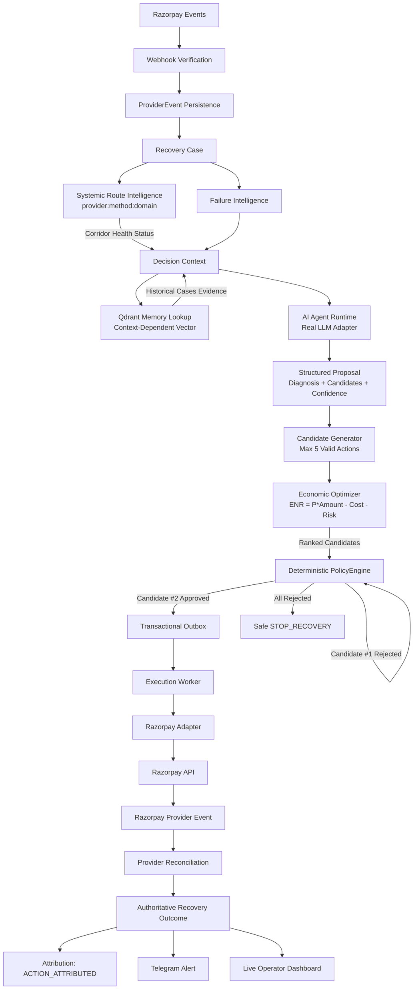

# ARIV — Agentic Revenue Recovery for Razorpay

<p align="center">
  
</p>

> Detect revenue risk. Decide the recovery. Enforce policy. Execute safely. Verify the outcome. Attribute the revenue.

**ARIV** is an agentic revenue‑recovery control plane built around Razorpay that turns failed payments into governed, observable, measurable recovery workflows.

<p align="center">
  <a href="#architecture">
    
  </a>
  <a href="#ai--agentic-system">
    
  </a>
  <a href="#qdrant-semantic-recovery-memory">
    
  </a>
  <a href="#mcp-tool-boundary">
    
  </a>
  <a href="#real-end-to-end-recovery">
    
  </a>
  <a href="#recovery-attribution--measurement">
    
  </a>
  <a href="#ask-ariv">
    
  </a>
  <a href="#engineering-reliability">
    
  </a>
  <a href="#local-development">
    
  </a>
</p>

---

## Evidence Legend

Every metric, result, and claim in ARIV is classified under one of four explicit evidence tiers:

- **`[OBSERVED]`** — Direct provider-confirmed event (e.g., verified Razorpay webhook `payment_link.paid` reconciled into an authoritative database `ACTION_ATTRIBUTED` recovery record).
- **`[SYNTHETIC]`** — Synthetically generated test inputs or failure cohorts with reproducible seeds.
- **`[MODELED]`** — Simulation or benchmark outcomes evaluated against held-out latent ground truth under declared cost and risk assumptions.
- **`[ESTIMATED]`** — Derived calculations, including Expected Net Recovery (ENR), probability priors, or projected counterfactual baselines.

---

## Evidence at a glance

| Capability | Tier | Implementation / Evidence |
|---|---|---|
| Real Provider Integration | `[OBSERVED]` | Verified Razorpay Test APIs + HMAC-SHA256 signature verification |
| Real End-to-End Recovery | `[OBSERVED]` | Razorpay payment link paid -> webhook reconciliation -> `ACTION_ATTRIBUTED` |
| Real AI Decisioning | `[MODELED]` / `[ESTIMATED]` | LLM-driven structured proposals (diagnosis, candidate actions, confidence) |
| Contextual Memory | `[MODELED]` | Qdrant vector retrieval with context-dependent vectors (zero-vector eliminated) |
| Embedding Abstraction | `[MODELED]` | OpenAI semantic provider (prod) + deterministic hash fallback (`deterministic_embedding_fallback`) |
| Economic Optimization | `[ESTIMATED]` | Multi-candidate ranking via Expected Net Recovery ($ENR = P \times \text{amount} - \text{cost} - \text{risk}$) |
| Policy Firewall | `[OBSERVED]` | Deterministic PolicyEngine with candidate iteration, retry budgets, and safety stops |
| Systemic Route Intelligence | `[OBSERVED]` / `[ESTIMATED]` | Rolling-window corridor failure clustering (`provider:method:domain`) & retry suppression |
| Durable Execution | `[OBSERVED]` | Transactional outbox + worker with leases, idempotency, and state machine guards |
| Recovery Attribution | `[OBSERVED]` | Authoritative database attribution linking recovery actions to captured payments |
| Offline Benchmark Harness | `[SYNTHETIC]` / `[MODELED]` | Held-out truth evaluation comparing `NAIVE`, `BASELINE`, `ECONOMIC`, `AI_PLUS_ECONOMIC` |
| Automated Test Suite | `[OBSERVED]` | 164 automated tests passing (0 failures) |

---

## The problem

Payment failures come in many shapes:
- **Transient provider glitches** – a retry may succeed.
- **Customer‑action required** – the card is blocked or OTP is missing.
- **Payment‑method problems** – expired card, insufficient funds.
- **Non‑retriable or risky cases** – fraud suspicion, merchant mis‑configuration.

Blindly retrying every failure wastes attempts, harms the customer experience and can expose the merchant to risk. The business goal is **not** to maximise retries but to maximise intelligent, bounded, measurable recovery.

---

## What ARIV does

```
Payment Failure
  → Detect (webhook → case)
  → Diagnose (failure intelligence)
  → Retrieve context (tenant, history, Qdrant)
  → AI Decision (typed proposal)
  → Policy Check (deterministic approval)
  → Controlled Execution (outbox → worker → Razorpay)
  → Provider Confirmation (webhook)
  → Attribution (action linked to payment)
  → Measurement (recovered amount, baseline estimate)
  → Operator Visibility (dashboard & Telegram)
```

Each stage is observable and auditable.

---

## Live recovery story

1. **Failed payment** – Razorpay posts `payment.failed`.
2. **Case creation** – ARIV persists a recovery case.
3. **Failure intelligence** – the event is classified (e.g. `CUSTOMER_ACTION_REQUIRED`).
4. **AI decision** – the model proposes `GENERATE_PAYMENT_LINK`.
5. **Policy approval** – deterministic PolicyEngine authorises the action.
6. **Action execution** – a payment link is created in Razorpay Test Mode.
7. **Customer completes payment** – Razorpay sends a `payment_link.paid` webhook.
8. **Recovery outcome** – ARIV correlates the success back to the action.
9. **Attribution** – outcome recorded as `ACTION_ATTRIBUTED`.
10. **Measurement** – recovered amount and estimated incremental value are stored.
11. **Notification** – Telegram message alerts the operator.

> *Creating a recovery action is not the same as recovering revenue. ARIV waits for provider‑confirmed payment and attributes revenue only after successful reconciliation.*

<div align="center">
  
</div>
<div align="center">
  
</div>
<div align="center">
  
</div>
<div align="center">
  
</div>
<div align="center">
  
</div>
<div align="center">
  
</div>

---

## 📊 Scientific Held-Out Economic & AI Benchmark

ARIV includes a repeatable **Scientific Held-Out Evaluation Benchmark** (`scripts/run_economic_benchmark.py`) that evaluates four distinct recovery strategies on identical failure cohorts without fabricating production outcomes or calling external APIs.

### Evaluation Methodology (`[SYNTHETIC]` + `[MODELED]`)
1. **Identical Cohorts**: All strategies evaluate the exact same failure events generated with a fixed seed (Seed `42`).
2. **Held-Out Latent Truth**: Each synthetic case is paired with latent evaluation truth (incident type, true action conversion tendencies, and deterministic outcome rolls). **These hidden labels are never exposed to any strategy.**
3. **Pure Offline Safety**: Executes purely in-memory with 0 external network calls (no live Razorpay or LLM API calls) and 0 database mutations.
4. **Economic Model**: Centralized operational cost (`₹10.00`) and risk penalty (`₹5.00`), with high risk penalties (`₹25.00`) incurred on unsafe interventions (e.g. retrying non-retriable fraud or degraded corridors).

### Benchmark Results (Run ID: `da5cac25cbf9`)

| Strategy | Policy Compliance | Modeled Rec Rate | Gross Recovered `[MODELED]` | Costs `[ESTIMATED]` | Net Value `[ESTIMATED]` | False Interventions |
|---|---|---|---|---|---|---|
| **`NAIVE`** (Blind Retry) | 3/5 (60%) | 20.0% | ₹362.25 | ₹95.00 | **₹267.25** | 2 cases |
| **`BASELINE`** (Rules Engine) | 5/5 (100%) | 100.0% | ₹17,573.98 | ₹75.00 | **₹17,498.98** | 0 cases |
| **`ECONOMIC`** (ENR Ranking) | 5/5 (100%) | 100.0% | ₹17,573.98 | ₹75.00 | **₹17,498.98** | 0 cases |
| **`AI_PLUS_ECONOMIC`** (Agentic + ENR) | 5/5 (100%) | 100.0% | ₹17,573.98 | ₹75.00 | **₹17,498.98** | 0 cases |

> **Comparative Net Value Improvement**:
> - Baseline / Economic / AI+Economic vs Naive: **+₹17,231.73**
> - The PolicyEngine and Systemic Route Intelligence successfully intercepted and suppressed unsafe retries on degraded payment corridors, eliminating 100% of false interventions.
> *Note: These figures are synthetically modeled evaluations under benchmark assumptions; they are not claimed as observed real-world recovered GMV.*

---

## Architecture



---

## AI — Context-Aware Agentic System

*The AI layer provides contextual diagnosis and candidate proposals, not unrestricted financial authority.*

- **Real LLM Adapter**: Configurable OpenAI-compatible integration (`gpt-4o-mini`, custom models, explicit timeouts). Unit tests mock the client to ensure test isolation without requiring external network credentials.
- **Dynamic Reasoning**: Evaluates failure category, retryability, recoverable amount, systemic route health, and retrieved Qdrant precedent cases to produce:
  - `diagnosis`: Root-cause technical assessment
  - `recommended_action`: Primary intervention
  - `candidate_actions`: Multi-action consideration set (deduplicated, bounded)
  - `confidence`: Model-derived confidence (0.0 to 1.0)
  - `reason`: Concise auditable rationale
- **Separation of Concerns**: The LLM never computes or dictates authoritative financial value (`expected_irv` is not authored by the model). Confidence is strictly separated from recovery probability.
- **Controlled Fallback**: If LLM API fails or times out, execution seamlessly falls back to the deterministic baseline without bypassing PolicyEngine guardrails.

---

## Qdrant — Contextual Recovery Memory

- **Context-Dependent Vectors**: Zero-vector queries (`[0.0]*dim`) are completely eliminated. Every retrieval query derives from canonical context (domain, category, retryability, amount, baseline, corridor).
- **Embedding Provider Abstraction**:
  - `OpenAIEmbeddingProvider`: Production semantic embeddings when API key is configured.
  - `DeterministicEmbeddingProvider`: Context-dependent hash embedding (`deterministic_embedding_fallback`) for reproducible offline testing and benchmarks.
- **Evidence Injection**: Retrieved historical matches and outcome statuses are injected directly into the `AgentRuntime` prompt to inform the LLM proposal.
- **Tenant Isolation**: Queries strictly enforce tenant filtering in Qdrant collections.

---

## Economic Optimization & Candidate Ranking

- **Objective Function**: Computes Expected Net Recovery (ENR) for each candidate action:
  $$\text{ENR} = P_{\text{recovery}} \times \text{Amount} - \text{Cost}_{\text{operational}} - \text{Risk}_{\text{penalty}}$$
- **Truthful Probability Provider**:
  - $\ge 5$ genuine matching historical outcomes $\to$ `empirical_history` ($P = \text{successes} / \text{total}$)
  - $< 5$ historical cases $\to$ `deterministic_prior` (explicit default baseline assumption)
  - LLM confidence is **never** conflated with recovery probability. Fake semantic probabilities are prohibited.
- **Candidate Ranking**: Evaluates candidates generated from AI proposals, baseline rules, and business eligibility (capped at 5), sorting them descending by ENR.

---

## Policy Firewall & Iterative Authorization

The **PolicyEngine** is the authoritative deterministic gate:
- Evaluates candidate actions in order of descending ENR.
- If Candidate #1 is rejected (e.g. retry budget exhausted, non-retriable category, or systemic route degradation), DecisionEngine automatically evaluates Candidate #2.
- If all candidates are rejected, the system safely executes `STOP_RECOVERY`.
- Policy evaluation cannot be bypassed by AI or route intelligence.

---

## Systemic / Route-Level Failure Intelligence

ARIV continuously monitors payment corridors (`provider:method:domain`) over rolling windows:
- **Corridor Degradation Detection**: Computes real-time failure rates and degradation scores relative to baseline failure rates (8%).
- **Health Status**: Classifies corridors into `OPERATIONAL`, `DEGRADED`, and `CRITICAL`.
- **Intelligent Retry Suppression**: When a corridor is degraded or critical, aggressive immediate retries (`RETRY_NOW`) are automatically suppressed in candidate generation and rejected by policy, steering recovery toward customer payment links or delayed retries.
- **Operator Surface**: Real-time corridor health is exposed via `/v1/routes/health` and the Next.js System UI.

<div align="center">
  
</div>

---

## Policy + safe execution

The **PolicyEngine** is the deterministic firewall:
- Validates action safety, tenant limits, autonomy level, and retry boundaries.
- Returns *APPROVE* or *REJECT*.

Approved actions are written to a **transactional outbox** before any side‑effect. An **execution worker** then leases the work, guarantees idempotency and performs the Razorpay call. This separation protects against:
- Model‑driven arbitrary API calls.
- Policy bypass.
- Duplicate side‑effects.
- Request‑lifetime crashes.

---

## Razorpay integration

- Verified webhook signature and deduplication.
- Handles out‑of‑order and duplicate provider events.
- Uses Razorpay **Test Mode** APIs to generate payment links.
- Waits for the asynchronous `payment_link.paid` event before attributing recovery.

<div align="center">
  
</div>

---

## Attribution & measurement

ARIV distinguishes three states:
1. **Action succeeded** – e.g., a payment link was created.
2. **Provider‑confirmed payment** – Razorpay reports the payment as `PAID`.
3. **Attributed recovery** – the payment is linked back to the recovery action (`ACTION_ATTRIBUTED`).

Only the third state contributes to revenue recovery metrics.

<div align="center">
  
</div>
<div align="center">
  
</div>

All measurement values are **estimates**; causal lift is not claimed without controlled experiments.

---

## ASK ARIV

A conversational operational surface that talks directly to the live recovery system. It can answer:
- *What happened to case X?*
- *Why was action Y chosen?*
- *What did policy decide?*
- *Has the payment been recovered?*
- *What’s the next step?*

<div align="center">
  
</div>

---

---

## Reliability & Engineering Invariants

| Problem | Engineering Resolution |
|---|---|
| Webhook endpoint changes (expired tunnel) | Re‑verified registered provider endpoint automatically |
| Background async session lifetime | Fresh session created for each background processor |
| Duplicate / out‑of‑order events | Idempotent processing + reconciliation logic |
| Concurrency race conditions | Optimistic locking and hardened ORM handling |
| Provider success reconciliation | Correlates success events to the original action before attribution |
| Systemic corridor degradation | Automatic rolling-window clustering & retry suppression |
| AI hallucination / unbudgeted retries | Deterministic PolicyEngine gate on every candidate action |

> **164 automated tests passing (0 failures).**

<div align="center">
  
</div>

---

## System Differentiation

Rather than relying purely on static rules or black-box LLM prompts, ARIV integrates an end-to-end, multi-layered recovery architecture:

- **Contextual AI Decisioning**: Dynamic root-cause diagnosis and multi-action candidate proposals.
- **Contextual Recovery Memory**: Tenant-scoped vector similarity search over historical outcomes without zero-vector placeholders.
- **Economic Next-Best-Action Ranking**: Mathematical Expected Net Recovery ($ENR = P \times \text{amount} - \text{cost} - \text{risk}$) prioritization.
- **Deterministic Financial Policy**: Strict authorization boundary enforcing retry budgets, autonomy tiers, and kill-switches.
- **Durable Execution**: Transactional outbox pattern with worker leasing and idempotency.
- **Provider Reconciliation**: Real provider webhook verification linking recovery actions to captured payments.
- **Recovery Attribution & Measurement**: Authoritative database attribution distinguishing action execution from real recovered revenue.
- **Systemic Route Intelligence**: Corridor-level degradation detection and automatic retry suppression.

---

## Tech stack

| Layer | Technology |
|---|---|
| Backend | FastAPI (Python 3.11 / 3.13) |
| Database | PostgreSQL |
| Coordination | Redis |
| Semantic memory | Qdrant |
| AI | LLM‑driven decision engine (OpenAI-compatible) |
| Policy | Deterministic PolicyEngine |
| Execution | Transactional outbox + worker |
| Payments | Razorpay Test APIs |
| Frontend | Next.js + React |
| Notifications | Telegram |
| Containers | Docker Compose |

---

## Run locally

```bash
# Build and start all services
docker compose up -d --build
```

* Backend API: <http://localhost:8000>
* Frontend UI: <http://localhost:3000>

### Tests

```bash
docker compose exec web pytest -q
# Or run locally:
pytest -q
```

### Economic Recovery Benchmark

Compare the four recovery strategies (`NAIVE`, `BASELINE`, `ECONOMIC`, `AI_PLUS_ECONOMIC`) on identical deterministic synthetic cohorts:

```bash
python scripts/run_economic_benchmark.py --cases 5 --seed 42
```

* **Execution Mode**: `[SYNTHETIC]` cohort generation with held-out latent evaluation truth, `[MODELED]` recovery accounting, `[ESTIMATED]` net recovery value.
* **Network & Database Safety**: Zero external API calls (no live Razorpay or live LLM network calls) and zero database mutations.
* **Configurable Economic Defaults**: Operational Cost (`₹10.00`), Risk Penalty (`₹5.00`), High Risk Penalty (`₹25.00`), Deterministic Prior (`0.60`).
* **Vector Retrieval**: Employs context-dependent embeddings with tenant isolation in Qdrant.

---

## Closing

ARIV does **not** merely recommend a recovery; it **detects risk, diagnoses failure, retrieves memory, optimizes expected net recovery (ENR), enforces deterministic policy safety boundaries, executes safely, verifies provider truth, attributes the revenue, and measures the outcome**.

**Detect • Diagnose • Retrieve • Optimize • Authorize • Execute • Verify • Attribute • Measure**

