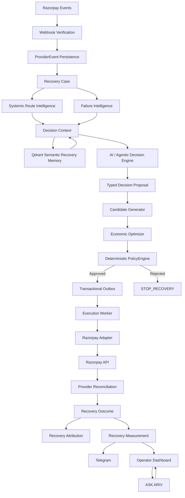

# ARIV — Agentic Revenue Recovery for Razorpay

**Detect a failed payment. Decide the best recovery. Authorize with deterministic policy. Execute safely. Verify provider truth. Attribute the revenue. Measure the outcome.**

ARIV is a recovery control plane for Razorpay that turns failed payments into governed, observable, measurable workflows. AI proposes; PolicyEngine authorizes; infrastructure executes; provider events establish truth.

---

## Executive summary

Recovering failed payments is not about retrying everything. Real recovery requires deciding *which* failures are worth acting on, doing so within strict safety and financial controls, and only crediting revenue after the payment provider confirms it. ARIV implements that end-to-end loop for Razorpay and proves it with real Test-Mode execution evidence, not simulated claims.

- **Decisioning**: failure classification + semantic memory + an AI/agentic layer that *proposes* a typed recovery decision.
- **Safety**: a deterministic PolicyEngine is the only authority that authorizes money-movement actions.
- **Execution**: durable transactional outbox → worker → Razorpay adapter.
- **Truth**: provider webhooks are verified and reconciled; revenue is attributed only after provider confirmation.
- **Control**: operator dashboard, Telegram alerts, and a conversational "ASK ARIV" layer grounded in live system state.

```
AI reasons and proposes → PolicyEngine authorizes → infrastructure executes → provider events establish truth
```

---

## Verified Test-Mode evidence

Two real test-mode benchmark runs exercised the **full execution pipeline** against Razorpay's real Test APIs: failure ingestion → decisioning → policy evaluation → provider execution. Everything below is recomputed from rows the pipeline persisted in PostgreSQL (see `docs/benchmark-results.md` for the independent SQL cross-check).

> **Reading this correctly:** these cohorts were *failure ingestion, decisioning, policy and execution* benchmarks. They did **not** include customers completing the generated recovery links, so verified-recovery and attributed-recovery are **zero**. This is honest — not a production performance claim.

### Benchmark A — Test-mode execution-scale pipeline benchmark
`benchmark_report_bench_20260907_041856_fa9508.json` · 25 cases · **₹35,232.60 at risk**

| Metric | Result |
|---|---|
| Cases decisioned | **25 / 25** (100%) |
| Policy evaluations / approvals | **25 / 25** |
| Execution attempts | **25** |
| Provider payment-link actions completed | **24 / 25** |
| Real Razorpay failures | **1** (`RATE_LIMIT_EXCEEDED`) |
| Verified recoveries | **0** |
| Attributed recoveries | **0** |
| Revenue recovered / recovery rate | **₹0 / 0%** |

### Benchmark B — Test-mode scenario-diversity / decision-policy benchmark
`benchmark_report_bench_20260907_045936_39bde5.json` · 18 cases · **₹145,400.00 at risk**

| Metric | Result |
|---|---|
| Cases decisioned | **18 / 18** (100%) |
| Decisions | RETRY_NOW **4** · GENERATE_PAYMENT_LINK **5** · STOP_RECOVERY **9** |
| Policy approved / needs review | **16 / 2** |
| Autonomy | FULL_AUTO **16** · HUMAN_APPROVAL **2** |
| Execution attempts / provider actions | **5 / 5** completed, **0** failures |
| Human escalations | **2** (B2B mandate + route-degradation cases) |
| Verified / attributed / revenue / recovery rate | **0 / 0 / ₹0 / 0%** |

### Real provider-confirmed recovery demonstration

Separately (not part of any benchmark denominator), ARIV demonstrated a real Razorpay Test-Mode, customer-completed recovery end-to-end:

```
payment failure → ARIV case → recovery decision → policy → recovery action
→ customer payment → Razorpay provider confirmation → RECOVERED
→ ACTION_ATTRIBUTED → measurement → Telegram
```

This is a single, real, provider-confirmed recovery demonstration — distinct from the failure-only benchmark cohorts above, which are intentionally kept out of recovery metrics.

---

## What problem ARIV solves

Payment failures are not a monolith:

- **Transient provider glitches** — a controlled retry may succeed.
- **Customer action required** — blocked card, missing OTP, needs a payment link.
- **Payment-method problems** — expired card, insufficient funds.
- **Non-retriable / risky** — fraud suspicion, degraded corridors.

Blindly retrying everything wastes attempts, hurts the customer, and increases risk. The business goal is **bounded, intelligently-selected, measurable recovery** — not maximum retries.

## End-to-end recovery loop

```
Payment Failure
 → Detect (webhook → Recovery Case)
 → Diagnose (Failure Intelligence)
 → Retrieve context (tenant, history, Qdrant)
 → AI decision (typed proposal)
 → Policy check (deterministic approval)
 → Controlled execution (outbox → worker → Razorpay)
 → Provider confirmation (webhook reconciliation)
 → Attribution (action ↔ payment)
 → Measurement (recovered amount)
 → Operator visibility (dashboard + Telegram)
```

Each stage is observable and auditable. **Creating an action is not recovering revenue** — revenue is counted only after provider-confirmed, attributed payment.

## Architecture



> The systems-integration box is a **typed capability / tool boundary**: a declared interface offering controlled, authorized actions to the decision and control layers — not a fully-fledged MCP server or an unrestricted agent-execution gateway.

## AI decision layer

The AI/agentic layer is a **context-aware recovery decision layer** that *proposes* — it does not move money.

- **Real LLM adapter** (OpenAI-compatible) with explicit timeouts; deterministic baseline fallback on failure — never bypassing policy.
- Produces a **structured, typed proposal**: diagnosis, recommended action, candidate actions, confidence (0.0–1.0), and an auditable reason.
- **Separation of concerns**: the model does not author authoritative financial value; model confidence is never conflated with recovery probability.
- AI **reasons and proposes → PolicyEngine authorizes → infrastructure executes**.

## Qdrant semantic memory

- **Contextual recovery memory**: tenant-scoped vector lookup of prior cases and their outcomes.
- **Context-dependent vectors** (no zero-vector), embedding abstraction (OpenAI semantic provider + deterministic hash fallback for offline/reproducible testing).
- Retrieved precedents are injected into the decision prompt; queries enforce tenant isolation.

## PolicyEngine / safety

The **PolicyEngine** is the deterministic financial firewall and the only authority that authorizes recovery actions:

- Validates safety, tenant limits, autonomy tier, retry budget, and systemic route health.
- Iterates candidates in ENR order, rejecting risky ones, and executes `STOP_RECOVERY` when none pass.
- Cannot be bypassed by AI or route intelligence.
- Economic ranking uses **Expected Net Recovery** `ENR = P × amount − cost − risk`, with probability from empirical history when available (else a stated deterministic prior).

Approved actions are written to a **transactional outbox** before any side effect; the execution worker leases, idempotently executes, and guards state transitions.

## Durable execution

Outbox + worker protects against model-driven arbitrary calls, policy bypass, duplicate side effects, and request-lifetime crashes. Optimistic locking and hardened ORM handling preserve concurrency correctness.

## Razorpay integration & provider truth

- HMAC-SHA256 webhook verification and deduplication; out-of-order and duplicate events handled.
- Razorpay **Test APIs** create payment links; execution waits for the async `payment_link.paid` event.
- **Provider reconciliation** correlates the success event to the originating action so attribution reflects provider truth.

## Attribution & measurement

Three distinct states:

1. **Action succeeded** — the link was created.
2. **Provider-confirmed payment** — Razorpay reports `PAID`.
3. **Attributed recovery** — the payment is linked to the recovery action (`ACTION_ATTRIBUTED`).

Only state 3 contributes to recovery revenue. Measurement values are estimates; causal lift is not claimed without controlled experiments.

## ASK ARIV

A conversational **operational control layer** grounded in actual ARIV state — it answers questions about live cases, decisions, policy outcomes, and next steps. It is a grounded routing/tool surface over real system data, **not** a general-purpose autonomous agent.

---

## Reliability & engineering invariants

Genuinely-solved engineering problems:

- **Expired webhook tunnel** — re-verifies the registered provider endpoint automatically.
- **Request-scoped async session in background processing** — fresh session per background task.
- **Provider success-event processing** — correlates success to the original action before attribution.
- **Concurrency / stale ORM state** — optimistic locking + hardened ORM handling.
- **Tenant isolation hardening** — fail-closed tenant resolution.
- **Provider reconciliation correctness** — verified, deduplicated, out-of-order-safe.
- **Outbox / execution reliability** — idempotency, leases, state-machine guards.
- **Case-detail endpoint & Qdrant consistency.**

## Technical decision — why this architecture is trustworthy

ARIV deliberately separates *judgment* from *authority*:

| Layer | Role | Trust property |
|---|---|---|
| AI / agentic layer | Reason, retrieve, propose | Cannot trigger money movement alone |
| PolicyEngine | Authorize | Deterministic, auditable, non-bypassable |
| Outbox + worker | Execute durably | Idempotent, crash-safe |
| Provider reconciliation | Confirm truth | Only provider confirmation counts |
| Attribution + measurement | Count revenue | Prevents false recovery claims |

**No single component can both decide on money and move it.** That separation is the core safety property.

---

## Local reproduction

```bash
docker compose up -d --build

# Backend API  -> http://localhost:8000
# Frontend UI -> http://localhost:3000
```

Requires Razorpay Test key + webhook secret in `.env` and `TEST_MODE`.

Run the verified test-mode pipeline benchmarks:

```bash
# Execution-scale (25 cases) — run from the repo root
python scripts/run_benchmark.py --cases 25 --min 5000 --max 250000 \
  --webhook-url http://localhost:8000/webhooks/razorpay \
  --account-id acc_benchmark --output-dir . --poll-interval 3 --max-wait 300

# Scenario-diversity (18-case cohort defined in JSON, order preserved)
python scripts/run_benchmark.py --scenario-file scripts/scenarios_mixed_18.json \
  --webhook-url http://localhost:8000/webhooks/razorpay \
  --account-id acc_benchmark --output-dir . --poll-interval 3 --max-wait 300
```

The synthetic economic/judge harnesses remain available for offline strategy comparison:

```bash
python scripts/run_economic_benchmark.py --cases 5 --seed 42
python scripts/run_judge_benchmark.py
```

Full metric definitions, formulas, zero-denominator handling, and independent SQL verification: [docs/benchmark-results.md](docs/benchmark-results.md). Judge-facing summary: [docs/benchmark-summary.md](docs/benchmark-summary.md).

## Tests

```bash
docker compose exec web pytest -q
```

**Current verified result: 222 passed · 1 skipped · 0 failed · 2 warnings.** (Run on 2026-09-07.) The 2 warnings are known pre-existing runtime warnings in a tenant-bootstrap test, not failures.

---

## Screenshots

| | |
|---|---|
| Command center |  |
| Failed-payment case |  |
| AI decision + policy |  |
| Recovery action |  |
| Razorpay test payment |  |
| Recovered attribution |  |
| Telegram recovery |  |
| ASK ARIV |  |
| Qdrant memory |  |
| System health |  |
| Measurement |  |

---

## Tech stack

| Layer | Technology |
|---|---|
| Backend | FastAPI (Python) |
| Database | PostgreSQL |
| Coordination | Redis |
| Semantic memory | Qdrant |
| AI | LLM-driven decision engine (OpenAI-compatible) |
| Policy | Deterministic PolicyEngine |
| Execution | Transactional outbox + execution worker |
| Payments | Razorpay Test APIs + webhooks |
| Notifications | Telegram |
| Control surface | "ASK ARIV" conversational layer |
| Containers | Docker Compose |

---

## Final takeaway

ARIV detects risk, diagnoses failure, retrieves memory, proposes the best recovery, enforces deterministic policy, executes safely and durably, verifies provider truth, attributes revenue, and measures outcomes. Its evidence is bounded and honest: execution-scale and scenario-diversity benchmarks prove the pipeline works, while the zero-recovery reading on failure-only cohorts and the separately demonstrated provider-confirmed recovery together show what is proven and what is claimed.

**Detect · Diagnose · Retrieve · Propose · Authorize · Execute · Verify · Attribute · Measure**