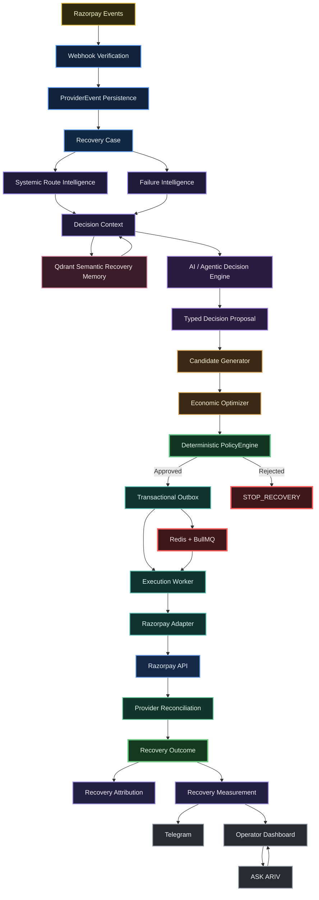

<div align="center">


# ARIV — Agentic Revenue Recovery for Razorpay


</div>

**Agentic AI** reasons, retrieves context, diagnoses failures, and proposes recovery actions.  
**Economic logic** ranks candidates.  
**PolicyEngine** authorizes financial actions.  
**Durable infrastructure** executes them.  
**Razorpay provider events** establish truth.  
**Attribution** determines recovered revenue.

*"Agentic" describes the reasoning/workflow layer — not unrestricted authority over money movement.*

**Detect a failed payment. Decide the best recovery. Authorize with deterministic policy. Execute safely. Verify provider truth. Attribute the revenue. Measure the outcome.**

ARIV is a recovery control plane for Razorpay that turns failed payments into governed, observable, measurable workflows.

---

# 🏆 Buildathon Submission Summary

**Problem Solved:** Recover failed payments intelligently — not blindly retry everything.

## Key Claims

- ✅ **Real Razorpay Test API integration** — not mocked.
- ✅ **Deterministic safety** — AI proposes, PolicyEngine authorizes.
- ✅ **No single layer moves money** — financial authority is isolated.
- ✅ **258/258 tests passing** — full stack reproducible locally.
- ✅ **Honest benchmarking** — 100% decision coverage, with explicitly **0% verified recovery on failure-only cohorts**.
- ✅ **Economic optimization** — systemic route awareness + ENR ranking showed modeled improvement.
- ✅ **Provider-confirmed recovery** — separately demonstrated through a real Razorpay Test-Mode customer-completed recovery flow.

## Why ARIV is different

### 1. 🏗️ Architecture trust

ARIV separates **judgment from authority**:

> AI can reason and propose.  
> Economic logic can rank.  
> PolicyEngine authorizes.  
> Durable execution performs.  
> Razorpay establishes truth.

### 2. 📏 Honest metrics

ARIV deliberately does **not** turn successful action creation into a recovery number.

> **Action ≠ recovery.**

Revenue is only counted after provider-confirmed payment and recovery attribution.

### 3. 🚀 Production-oriented engineering

The system uses durable persistence, idempotent execution, tenant isolation, provider reconciliation, deterministic policy controls, background workers, semantic memory, and a reproducible local stack.

---

# 💻 Technology at a Glance

| Technology | Role in ARIV |
|---|---|
| **FastAPI** | Async backend APIs and webhook endpoints |
| **PostgreSQL** | Authoritative transactional state |
| **Redis** | Coordination, deduplication, and fast-path state |
| **Qdrant** | Tenant-scoped semantic recovery memory |
| **LLM / OpenAI-compatible adapter** | Context-aware recovery reasoning |
| **PolicyEngine** | Deterministic financial authorization |
| **Transactional Outbox** | Durable side-effect boundary |
| **Execution Worker** | Idempotent background execution |
| **Razorpay Test APIs** | Provider-side Test Mode execution |
| **Razorpay Webhooks** | Provider-side event truth |
| **Next.js / React** | Operator control surface |
| **Docker Compose** | Reproducible local environment |

---

# 🧠 Executive Summary

Recovering failed payments is not about retrying everything.

Real recovery requires deciding *which* failures are worth acting on, doing so within strict safety and financial controls, and only crediting revenue after the payment provider confirms it. ARIV implements that end-to-end loop for Razorpay and proves it with real Test-Mode execution evidence.

- **Decisioning**: failure classification + semantic memory + an agentic AI layer that *proposes* a typed recovery decision.
- **Ranking**: a deterministic economic optimizer ranks candidate actions by Expected Net Recovery (ENR).
- **Safety**: a deterministic PolicyEngine is the only authority that authorizes money-movement actions.
- **Execution**: durable transactional outbox → worker → Razorpay adapter.
- **Truth**: provider webhooks are verified and reconciled; revenue is attributed only after provider confirmation.
- **Control**: operator dashboard, Telegram alerts, and a conversational **ASK ARIV** layer grounded in live system state.

```text
AI proposes → Economic logic ranks → PolicyEngine authorizes
→ infrastructure executes → provider events establish truth
```

---

# 🔄 End-to-End Recovery Loop

```text
Payment Failure
      ↓
Detect
(webhook → ProviderEvent → Recovery Case)
      ↓
Diagnose
(Failure Intelligence + Systemic Route Intelligence)
      ↓
Retrieve Context
(PostgreSQL + Qdrant + case history)
      ↓
AI Decision
(typed proposal)
      ↓
Candidate Generation
      ↓
Economic Ranking
(ENR)
      ↓
Policy Check
(deterministic authorization)
      ↓
Controlled Execution
(Outbox → Worker → Razorpay Adapter)
      ↓
Provider Confirmation
(webhook reconciliation)
      ↓
Recovery Outcome
      ↓
Recovery Attribution
      ↓
Recovery Measurement
      ↓
Operator Visibility
(Dashboard + Telegram + ASK ARIV)
```

Each stage is observable and auditable.

> **Creating an action is not recovering revenue.**

Revenue is counted only after provider-confirmed, attributed payment.

---

# 🧪 Verified Test-Mode Evidence

Two real Test-Mode benchmark runs exercised the **full execution pipeline** against Razorpay's real Test APIs.

```text
Failure ingestion
      ↓
Decisioning
      ↓
Policy evaluation
      ↓
Provider execution
```

Everything below is recomputed from rows the pipeline persisted in PostgreSQL.

See `docs/benchmark-results.md` for the independent SQL cross-check.

> **Important:** these cohorts were failure-ingestion, decisioning, policy, and execution benchmarks. They did **not** include customers completing the generated recovery links. Therefore verified recovery and attributed recovery are **0** in these cohorts. This is an honest measurement boundary, not a production recovery claim.

## Benchmark A — Test-Mode Execution-Scale Pipeline Benchmark

`benchmark_report_bench_20260907_041856_fa9508.json`  
**25 cases · ₹35,232.60 at risk**

| Metric | Result |
|---|---|
| Cases decisioned | **25 / 25 (100%)** |
| Policy evaluations / approvals | **25 / 25** |
| Execution attempts | **25** |
| Provider payment-link actions completed | **24 / 25** |
| Real Razorpay failures | **1** (`RATE_LIMIT_EXCEEDED`) |
| Verified recoveries | **0** |
| Attributed recoveries | **0** |
| Revenue recovered / recovery rate | **₹0 / 0%** |

## Benchmark B — Test-Mode Scenario-Diversity / Decision-Policy Benchmark

`benchmark_report_bench_20260907_045936_39bde5.json`  
**18 cases · ₹145,400.00 at risk**

| Metric | Result |
|---|---|
| Cases decisioned | **18 / 18 (100%)** |
| Decisions | `RETRY_NOW` **4** · `GENERATE_PAYMENT_LINK` **5** · `STOP_RECOVERY` **9** |
| Policy approved / needs review | **16 / 2** |
| Autonomy | `FULL_AUTO` **16** · `HUMAN_APPROVAL` **2** |
| Execution attempts / provider actions | **5 / 5 completed**, **0** failures |
| Human escalations | **2** (B2B mandate + route-degradation cases) |
| Verified recoveries | **0** |
| Attributed recoveries | **0** |
| Revenue recovered / recovery rate | **₹0 / 0%** |

---

# 💰 Real Provider-Confirmed Recovery Demonstration

Separately from the benchmark cohorts, ARIV demonstrated a **real Razorpay Test-Mode customer-completed recovery** end-to-end.

This recovery is intentionally kept **outside the benchmark denominators**.

```text
payment failure
      ↓
ARIV Recovery Case
      ↓
Recovery Decision
      ↓
PolicyEngine
      ↓
Recovery Action
      ↓
Customer Payment
      ↓
Razorpay Provider Confirmation
      ↓
RECOVERED
      ↓
ACTION_ATTRIBUTED
      ↓
Measurement
      ↓
Telegram
```

This is a single, real, provider-confirmed recovery demonstration.

It is not presented as a benchmark recovery rate.

---

# ⚖️ Competitive Comparison vs Baseline

ARIV is designed to be evaluated against simpler recovery strategies rather than only against its own internal metrics.

| Strategy | Behavior |
|---|---|
| **No intervention** | Do nothing after the payment failure |
| **Naive retry** | Retry according to a fixed retry schedule |
| **Rule-based recovery** | Apply fixed failure-code / rule mappings |
| **ARIV** | Diagnose → generate candidates → rank economically → apply policy → execute durably → verify provider outcome |

The engineering objective is not:

> **“Do more retries.”**

It is:

> **“Take the right action for the right failure, stop when recovery is unsafe or uneconomic, and prove the financial outcome.”**

---

# 🧠 Technical Differentiation from Rule-Based Recovery

| Layer | Rule-Based Competitor | ARIV |
|---|---|---|
| **Diagnosis** | Fixed regex / static patterns | Failure Intelligence + contextual diagnosis |
| **Context** | Limited / static | Case state + history + Qdrant semantic memory |
| **Reasoning** | Fixed rules | Agentic AI proposal layer |
| **Ranking** | Hard-coded if/then | Economic optimization using ENR |
| **System awareness** | Per-payment | Individual + systemic route intelligence |
| **Safety** | Retry limits / predefined rules | Deterministic PolicyEngine |
| **Execution** | Direct action path | Transactional Outbox + Worker + Provider Adapter |
| **Truth** | Local action state | Provider confirmation + reconciliation |
| **Attribution** | Often implicit | Explicit action ↔ payment attribution |
| **Measurement** | Action / retry counts | Verified recovery outcome measurement |
| **Adaptation** | Modify rules / code | Context + semantic memory + systemic intelligence |

### Why it matters

ARIV is not simply another retry tool.

Its architecture separates:

```text
Reasoning
    ≠
Economic Selection
    ≠
Authority
    ≠
Execution
    ≠
Provider Truth
    ≠
Measurement
```

---

# 🏗️ Architecture



> The systems-integration boundary is a **typed capability / tool boundary**: a declared interface offering controlled, authorized actions to the decision and control layers — not a fully-fledged MCP server or an unrestricted agent-execution gateway.

---

# 🤖 Agentic AI Decision Layer

ARIV uses an **agentic reasoning layer** to:

- diagnose payment failures
- retrieve relevant recovery context
- evaluate candidate interventions
- produce structured recovery proposals
- explain decisions to operators

The agent does **not** authorize or directly execute financial actions.

```text
Agentic AI
    ↓
Typed Proposal
    ↓
Candidate Generation
    ↓
Economic Ranking
    ↓
PolicyEngine
    ↓
Execution
```

## AI is advisory by design

- AI **proposes structured decisions**; it does not own authoritative financial state.
- The model payload is sanitized to advisory fields.
- Financial, authorization, and provider-truth fields are not delegated to the model.
- AI **cannot bypass PolicyEngine**.
- **Model confidence is not recovery probability.**
- Recovery probabilities and ENR come from deterministic components such as `ProbabilityProvider` and `EconomicOptimizer`.
- The real LLM adapter uses an OpenAI-compatible interface with explicit timeouts.
- Deterministic fallback behavior is available if the model is unavailable.
- Fallback never bypasses policy.
- Decisions are represented as structured, typed proposals suitable for auditing.

This is intentionally designed around:

> **AI for judgment. Deterministic infrastructure for authority.**

---

# 🧠 Qdrant Semantic Recovery Memory

Qdrant acts as **semantic recovery memory**, not authoritative financial state.

### Responsibilities

- 🔎 Tenant-scoped retrieval of related historical recovery cases
- 🧠 Contextual precedents for diagnosis and decision reasoning
- 📚 Historical outcome retrieval
- 🔐 Tenant isolation during retrieval
- 🧩 Embedding abstraction for online and deterministic offline execution

Qdrant supports:

- contextual recovery memory
- context-dependent vectors
- OpenAI semantic embeddings
- deterministic hash fallback for offline/reproducible testing

Retrieved precedents are injected into the decision prompt.

> **PostgreSQL = authoritative state**  
> **Qdrant = contextual semantic memory**

---

# 🧮 Economic Optimization

ARIV ranks recovery candidates using **Expected Net Recovery (ENR)**.

Conceptually:

```text
ENR = Probability of Recovery × Recoverable Amount
      − Intervention Cost
      − Risk Penalty
```

The objective is therefore not:

> **maximize retries**

but:

> **maximize expected net recovered value within the safety envelope.**

ENR ties are resolved deterministically so candidate ordering cannot create hidden model influence.

---

# 🛡️ PolicyEngine / Safety Boundary

The `PolicyEngine` is the deterministic financial firewall.

It is the **only authority that authorizes recovery actions**.

### Responsibilities

- tenant-level limits
- action safety
- retry budgets
- autonomy tier
- payment state
- systemic route health
- action-specific constraints
- human-approval requirements
- candidate rejection
- `STOP_RECOVERY` when no candidate passes

### Deterministic ranking

Economic ranking uses:

```text
ENR = P × amount − cost − risk
```

where:

- `P` = deterministic recovery probability
- `amount` = recoverable amount
- `cost` = execution / recovery cost
- `risk` = modeled risk penalty

Probability comes from empirical history when available, otherwise from a stated deterministic prior.

### Order-neutrality

ENR ties are resolved deterministically:

```text
baseline action
    ↓
fixed tier order
```

This prevents candidate ordering from allowing AI output to steer an economic tie.

### Candidate evaluation

```text
Candidate Generator
        ↓
Economic Optimizer
        ↓
ENR ordering
        ↓
PolicyEngine
        ↓
Approved candidate
        OR
STOP_RECOVERY
```

The PolicyEngine cannot be bypassed by AI or route intelligence.

---

# 🔒 Durable Execution

Approved actions are written to a **transactional outbox** before external side effects.

```text
Policy approval
      ↓
Transactional Outbox
      ↓
Execution Worker
      ↓
Razorpay Adapter
      ↓
Razorpay API
```

The execution layer provides:

- idempotent processing
- background execution
- durable execution intent
- worker leases
- state-transition guards
- retry-safe behavior
- crash recovery
- protection against duplicate side effects

This creates a strong separation between:

```text
Decision
    ↓
Authorization
    ↓
Durable Intent
    ↓
Execution
```

---

# 🔴 Redis + BullMQ Coordination

Redis is used for fast-path coordination and queue-backed execution behavior.

It supports:

- asynchronous workload coordination
- deduplication
- worker orchestration
- short-lived operational state

Redis is **not** treated as the authoritative source of payment truth.

---

# 💳 Razorpay Integration & Provider Truth

ARIV integrates with Razorpay Test APIs and webhooks.

## Webhook handling

- HMAC-SHA256 webhook verification
- event deduplication
- duplicate-event handling
- out-of-order event handling
- provider-event persistence

## Test-Mode execution

Razorpay Test APIs create payment links.

Execution then waits for the asynchronous provider event:

```text
payment_link.paid
```

## Provider reconciliation

The reconciliation layer correlates the provider success event with the originating recovery action.

This ensures attribution is based on:

> **Provider truth — not merely local execution success.**

---

# 🔎 Provider Reconciliation

Provider reconciliation is a separate architectural boundary because a local API response is not sufficient evidence of recovered revenue.

ARIV explicitly distinguishes:

1. **Action created**
2. **Provider-confirmed payment**
3. **Attributed recovery**

Therefore:

```text
Execution success
      ≠
Payment success
      ≠
Attributed recovery
```

This separation is central to financial correctness.

---

# 📊 Attribution & Measurement

ARIV tracks recovery in explicit states.

## State 1 — Action succeeded

Example:

```text
Payment Link Created
```

This means ARIV successfully performed an intervention.

It does **not** mean revenue was recovered.

## State 2 — Provider-confirmed payment

Razorpay reports:

```text
PAID
```

Now the payment is real from the provider's perspective.

## State 3 — Attributed recovery

The confirmed payment is linked to the originating recovery action:

```text
ACTION_ATTRIBUTED
```

Only this state contributes to recovery revenue.

```text
Action succeeded
      ≠
Provider-confirmed payment
      ≠
Attributed recovery
```

This prevents false recovery claims.

Measurement values are estimates where appropriate.

**Causal lift is not claimed without controlled experiments.**

---

# 💬 ASK ARIV

**ASK ARIV** is the conversational operational control layer.

It is grounded in actual ARIV state and can answer questions about:

- live recovery cases
- payment failures
- diagnosis
- decisions
- policy outcomes
- recovery actions
- provider state
- recovery attribution
- latest activity
- next steps

ASK ARIV is not a general-purpose autonomous money-moving agent.

It is a **grounded operational interface over actual ARIV system state**.

---

# 📡 Operator Visibility

## 🖥️ Operator Dashboard

The dashboard provides visibility into:

- active recovery cases
- failure diagnosis
- recovery decisions
- policy outcomes
- execution state
- provider outcomes
- measurements
- system health

## 📲 Telegram

Recovery events and important outcomes can be pushed to operators.

Example:

```text
RECOVERY VERIFIED
→ Provider confirmed
→ Action attributed
→ Revenue measured
→ Telegram notification
```

---

# 🏛️ Technical Decision — Why This Architecture Is Trustworthy

ARIV deliberately separates *judgment* from *authority*.

| Layer | Role | Trust Property |
|---|---|---|
| Agentic AI layer | Reason, retrieve, propose | Cannot trigger money movement alone |
| Economic Optimizer | Rank candidates | Deterministic financial ranking |
| PolicyEngine | Authorize | Deterministic, auditable, non-bypassable |
| Outbox + Worker | Execute durably | Idempotent, crash-safe |
| Provider Reconciliation | Confirm truth | Only provider confirmation counts |
| Attribution + Measurement | Count revenue | Prevents false recovery claims |

### Core safety property

> **No single component can both decide on money and move it.**

That separation is the architectural foundation of ARIV.

---

# 🧱 Multi-Tenant & Security Model

ARIV is designed around tenant-isolated system state.

Key controls include:

- tenant-aware database access
- tenant-scoped semantic retrieval
- signed request identity
- internal API protection
- webhook verification
- fail-closed tenant resolution
- secret isolation through environment configuration

Tenant context is part of the control path rather than a UI-level convention.

---

# 🛠️ Reliability & Engineering Invariants

Genuinely solved engineering problems include:

- **Expired webhook tunnel** — registered provider endpoint was refreshed and verified.
- **Request-scoped async session in background processing** — fresh session per background task.
- **Provider success-event processing** — correlates success to the original action before attribution.
- **Concurrency / stale ORM state** — optimistic locking + hardened ORM handling.
- **Tenant isolation hardening** — fail-closed tenant resolution.
- **Provider reconciliation correctness** — verified, deduplicated, out-of-order-safe.
- **Outbox / execution reliability** — idempotency, leases, state-machine guards.
- **Case-detail endpoint & Qdrant consistency.**

---

# 🏗️ Engineering Design Principles

## 1. Judgment and authority are different things

```text
AI            → Judgment
Economic      → Ranking
PolicyEngine  → Authority
Worker        → Execution
Razorpay      → Provider Truth
Attribution   → Financial Measurement
```

## 2. External truth beats local assumptions

A local API response is not enough to claim recovered revenue.

Provider confirmation establishes the externally observed payment state.

## 3. Every side effect needs a durable boundary

Approved actions cross the outbox before execution.

## 4. Stopping is a valid decision

The system should stop instead of forcing a recovery action when the action is unsafe, non-retriable, or economically unjustified.

## 5. AI must remain bounded

The agentic layer improves diagnosis and reasoning without becoming the sole authority over financial actions.

---

# 🧮 What the Ablation Actually Found

The repository's **offline, modeled ablation** uses:

```text
10 seeds
×
10,000 synthetic cases
×
frozen Phase-1 baseline
×
common random numbers
×
held-out evaluator truth
```

These experiments measure the incremental value of individual intelligence layers.

> ⚠️ These are **modeled / offline ablation findings**, not real-money causal measurements.

| Comparison | Result |
|---|---|
| Economic vs rules baseline | **Economic strategy wins** |
| AI + Economic vs Economic | AI layer **did not improve modeled net recovery** in the reported ablation |
| + Qdrant memory vs AI + Economic | Memory **did not improve modeled net recovery** in the reported ablation |
| + Systemic / route-aware layer | **Improved the modeled result** relative to the preceding variant |
| Full stack vs Economic | Full stack **did not outperform Economic** in the reported ablation |

### Engineering takeaway

This result is important rather than something to hide.

> **ARIV does not treat AI as a magical source of financial performance.**

The evaluation indicates that deterministic economic optimization is the strongest direct driver in the modeled benchmark, while the AI and semantic-memory layers provide **diagnosis, context, reasoning, explainability, and operator intelligence**.

Systemic / route-aware intelligence produced the modeled improvement observed in the reported sequence.

The architecture therefore keeps financial authority deterministic even when AI becomes more capable.

See:

`artifacts/benchmarks/phase2_ablation_report.md`

for the complete numbers.

---

# 🆚 Why ARIV Is More Than a Retry Tool

A naive system might implement:

```text
Payment Failed
      ↓
Retry
      ↓
Retry
      ↓
Retry
```

ARIV instead asks:

```text
Why did it fail?
      ↓
Is recovery possible?
      ↓
What actions are candidates?
      ↓
Which action has the best expected net value?
      ↓
Is the action allowed?
      ↓
Can it execute safely?
      ↓
Did the provider actually confirm payment?
      ↓
Can the payment be attributed?
      ↓
How much revenue was recovered?
```

That difference is the core product and engineering idea.

---

# ⚖️ What ARIV Does NOT Claim

ARIV does **not** claim:

- ❌ that 100% decision coverage means 100% payment recovery
- ❌ that payment-link creation equals recovered revenue
- ❌ that the AI layer alone improves recovery
- ❌ that Qdrant memory alone improves recovery
- ❌ that offline synthetic ablation proves real-world causal lift
- ❌ that a single recovery demonstration represents a production recovery rate
- ❌ that Test Mode performance equals production financial performance

Instead, ARIV reports exactly what each experiment demonstrates.

---

# 🔬 Evaluation Philosophy

ARIV follows three principles.

## 1. Measure the full lifecycle

```text
Decision
→ Action
→ Provider Confirmation
→ Attribution
→ Revenue
```

not merely:

```text
Decision
→ Action
```

## 2. Separate modeled results from real provider evidence

Offline synthetic experiments are labeled as modeled.

Razorpay Test-Mode execution is labeled as provider integration evidence.

## 3. Never manufacture a recovery metric

If the benchmark does not contain completed customer recoveries:

```text
Recovery = 0
```

rather than estimating or inventing one.

---

# 🧪 Tests

Run the full test suite:

```bash
docker compose exec web pytest -q
```

Current verified result:

```text
258 passed
1 skipped
0 failed
2 warnings
```

The two warnings are known pre-existing runtime warnings in a tenant-bootstrap test and are not test failures.

Verified on:

```text
2026-09-07
```

---

# 🚀 Local Reproduction

You can fork ARIV, clone your fork, configure Razorpay Test Mode, and run the complete local stack with Docker Compose.

## 1. Fork

Open:

```text
https://github.com/praveen0767/ARIV
```

Click **Fork** and create your own copy.

## 2. Clone

```bash
git clone https://github.com/<your-username>/ARIV.git
cd ARIV
```

## 3. Configure Environment

```bash
cp .env.example .env
```

Fill in the required local environment values.

For the complete Razorpay Test Mode flow you need:

- **Razorpay Test Mode credentials**
- **Webhook secret**
- **`TEST_MODE`**

Telegram configuration is optional and only needed for Telegram notifications.

> 🔐 **Never commit `.env`, API keys, webhook secrets, Telegram tokens, or other credentials.**

## 4. Start ARIV

```bash
docker compose up -d --build
```

Then:

```bash
docker compose ps
```

Services:

```text
Frontend → http://localhost:3000
Backend  → http://localhost:8000
```

## 5. Verify Installation

```bash
docker compose exec web pytest -q
```

Expected current result:

```text
258 passed
1 skipped
0 failed
2 warnings
```

## 6. Run ARIV

The lifecycle is:

```text
Payment Failure
 → Webhook Ingestion
 → Recovery Case
 → Failure Intelligence
 → AI Proposal
 → Economic Ranking
 → PolicyEngine
 → Durable Execution
 → Razorpay Test Action
 → Provider Confirmation
 → Recovery Attribution
 → Measurement
```

## 7. Stop the Environment

```bash
docker compose down
```

To also remove volumes and create a fresh database:

```bash
docker compose down -v
```

---

# 📈 Reproduce the Test-Mode Benchmarks

## Execution-scale benchmark — 25 cases

Run from the repository root:

```bash
python scripts/run_benchmark.py --cases 25 --min 5000 --max 250000 \
  --webhook-url http://localhost:8000/webhooks/razorpay \
  --account-id acc_benchmark --output-dir . --poll-interval 3 --max-wait 300
```

## Scenario-diversity benchmark — 18 cases

```bash
python scripts/run_benchmark.py --scenario-file scripts/scenarios_mixed_18.json \
  --webhook-url http://localhost:8000/webhooks/razorpay \
  --account-id acc_benchmark --output-dir . --poll-interval 3 --max-wait 300
```

---

# 🧮 Offline Strategy Comparison

Synthetic economic and judge harnesses remain available for offline strategy comparison.

```bash
python scripts/run_economic_benchmark.py --cases 5 --seed 42
python scripts/run_judge_benchmark.py
```

Full metric definitions, formulas, zero-denominator handling, and independent SQL verification:

`docs/benchmark-results.md`

Judge-facing summary:

`docs/benchmark-summary.md`

---

# 🎯 How Judges Should Evaluate ARIV

The fastest way to evaluate ARIV is to reproduce the actual control path rather than relying on screenshots alone.

## 1. Deploy locally

```bash
docker compose up -d --build
```

## 2. Verify the test suite

```bash
docker compose exec web pytest -q
```

Expected:

```text
258 passed
1 skipped
0 failed
```

## 3. Run a benchmark

Use the benchmark scripts to exercise:

```text
Failure
→ Decision
→ Policy
→ Execution
```

## 4. Check the dashboard

Open:

```text
http://localhost:3000
```

Inspect:

- case diagnosis
- decision
- policy outcome
- execution state
- provider state
- measurements

## 5. Verify the safety boundary

Search the codebase for:

```text
PolicyEngine
```

The key architectural invariant is:

> **AI cannot bypass the deterministic authorization layer.**

## 6. Verify provider truth

Trace:

```text
Razorpay API
→ Provider Reconciliation
→ Recovery Outcome
→ Recovery Attribution
```

## 7. Verify what actually counts as revenue

The recovery metric should only increase after:

```text
provider-confirmed payment
+
action attribution
```

---

# 🧩 Architectural Invariants

ARIV preserves the following invariants:

```text
1. Provider events are verified and persisted.

2. Recovery cases are tenant-scoped.

3. AI output is advisory.

4. Economic ranking is deterministic.

5. PolicyEngine is the financial authorization boundary.

6. Approved actions pass through durable execution.

7. Execution is idempotent.

8. Provider success is reconciled against the originating action.

9. Recovery revenue requires provider-confirmed attribution.

10. Measurement does not silently convert actions into recoveries.
```

---

# 📸 Screenshots

| | |
|---|---|
| Command center |  |
| Failed-payment case |  |
| AI decision + policy |  |
| Recovery action |  |
| Razorpay test payment |  |
| Recovered attribution |  |
| Telegram recovery |  |
| ASK ARIV |  |
| Qdrant memory |  |
| System health |  |
| Measurement |  |

---

# 🎥 Product Walkthrough

A concise walkthrough of the ARIV recovery workflow:

```text
Failure Detection
→ AI Diagnosis
→ Qdrant Context
→ Recovery Decision
→ Economic Ranking
→ Policy Enforcement
→ Razorpay Execution
→ Provider Confirmation
→ Recovery Attribution
→ Measurement
→ Telegram
→ ASK ARIV
```

### ▶️ Video

https://www.youtube.com/watch?v=vkv6G-Nq67s

---

# 🏆 Why ARIV Is Built Differently

ARIV does not claim that AI alone solves payment recovery.

Instead, it combines multiple layers with explicit responsibilities:

```text
                    ┌─────────────────────────┐
                    │      Razorpay Events     │
                    │      Provider Truth      │
                    └────────────┬────────────┘
                                 ↓
                    ┌─────────────────────────┐
                    │   Failure Intelligence  │
                    └────────────┬────────────┘
                                 ↓
                    ┌─────────────────────────┐
                    │   Context + Qdrant       │
                    └────────────┬────────────┘
                                 ↓
                    ┌─────────────────────────┐
                    │      Agentic AI          │
                    │       PROPOSES           │
                    └────────────┬────────────┘
                                 ↓
                    ┌─────────────────────────┐
                    │  Economic Optimizer      │
                    │       RANKS              │
                    └────────────┬────────────┘
                                 ↓
                    ┌─────────────────────────┐
                    │     PolicyEngine         │
                    │      AUTHORIZES          │
                    └────────────┬────────────┘
                                 ↓
                    ┌─────────────────────────┐
                    │ Outbox + Execution Worker│
                    │        EXECUTES          │
                    └────────────┬────────────┘
                                 ↓
                    ┌─────────────────────────┐
                    │ Razorpay Test API        │
                    └────────────┬────────────┘
                                 ↓
                    ┌─────────────────────────┐
                    │ Provider Reconciliation  │
                    │        VERIFIES          │
                    └────────────┬────────────┘
                                 ↓
                    ┌─────────────────────────┐
                    │ Attribution + Measurement│
                    │         COUNTS           │
                    └─────────────────────────┘
```

The important property is not merely the number of components.

It is the **separation of responsibilities**.

---

# 🔐 Trust Model

ARIV follows a simple rule:

```text
AI can reason.
AI can propose.
AI cannot authorize.
AI cannot bypass policy.
AI cannot directly move money.
```

Financial authority belongs to the deterministic PolicyEngine.

Execution belongs to durable infrastructure.

Provider truth belongs to Razorpay events.

Revenue attribution belongs to the attribution layer.

---

# 📊 Evidence Model

ARIV intentionally distinguishes between different types of evidence.

| Evidence | What it proves |
|---|---|
| **258 tests passing** | Software behavior and regression coverage |
| **Razorpay Test API execution** | Real provider integration in Test Mode |
| **100% decision coverage** | Benchmark decision-pipeline coverage |
| **0% recovery on failure-only cohorts** | No unsupported recovery claim |
| **Provider-confirmed recovery demo** | Real end-to-end recovery path was demonstrated |
| **Offline ablation** | Modeled comparison of architectural layers |
| **Systemic route improvement** | Modeled improvement in the reported ablation |
| **No causal lift claim** | Avoids overstating benchmark evidence |

This evidence discipline is intentional.

---

# 🧭 Competitive Evaluation Positioning

ARIV is strongest when evaluated as a **fintech control plane**, not merely as a retry automation tool.

The central distinction is:

```text
Recovery Workflow
        ↓
Detect → Decide → Execute
```

versus:

```text
Financial Recovery Control Plane
        ↓
Detect
  ↓
Diagnose
  ↓
Retrieve Context
  ↓
Propose
  ↓
Optimize
  ↓
Authorize
  ↓
Execute
  ↓
Verify Provider Truth
  ↓
Attribute
  ↓
Measure
```

The second model explicitly separates the financial control boundaries required around money-moving workflows.

---

# ✅ Final Takeaway

ARIV is a **recovery control plane for Razorpay**.

It combines:

- 🤖 **Agentic reasoning**
- 🧠 **Semantic recovery memory**
- 🧮 **Economic optimization**
- 🛡️ **Deterministic financial policy**
- 🔒 **Durable execution**
- 🔴 **Redis + BullMQ coordination**
- 💳 **Real Razorpay Test APIs**
- 🔎 **Provider reconciliation**
- 💰 **Recovery attribution**
- 📊 **Outcome measurement**
- 🖥️ **Operator visibility**
- 💬 **ASK ARIV**

The core loop is:

```text
Detect
→ Diagnose
→ Retrieve
→ Propose
→ Rank
→ Authorize
→ Execute
→ Verify
→ Attribute
→ Measure
```

The engineering claim is intentionally bounded:

> **ARIV does not claim that every intelligent layer improves financial recovery. It proves the execution and control plane, reports benchmark outcomes honestly, separates modeled ablation from real provider evidence, and keeps financial authority deterministic.**

**AI proposes. Economic logic ranks. PolicyEngine authorizes. Durable infrastructure executes. Razorpay establishes truth. Attribution measures the money.**

---

# 🚀 ARIV

**Detect · Diagnose · Retrieve · Propose · Rank · Authorize · Execute · Verify · Attribute · Measure**

---