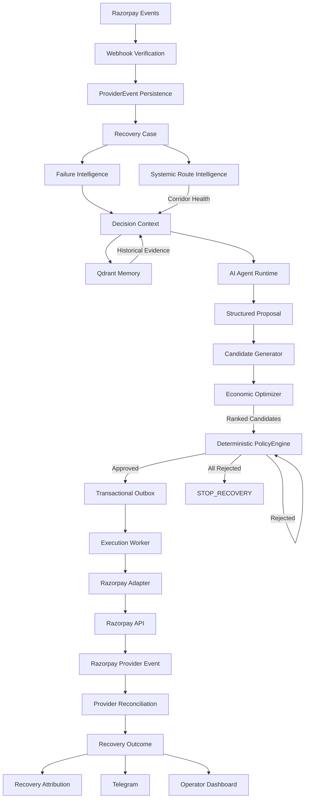

# ARIV — Agentic Revenue Recovery for Razorpay

<p align="center">
  
</p>

<p align="center">
  <strong>Detect revenue risk. Decide the recovery. Enforce policy. Execute safely. Verify the outcome. Attribute the revenue.</strong>
</p>

<p align="center">
  <a href="#architecture">Architecture</a> •
  <a href="#live-recovery">Live Recovery</a> •
  <a href="#ai-agentic-system">AI / Agentic</a> •
  <a href="#qdrant-contextual-recovery-memory">Qdrant</a> •
  <a href="#economic-optimization">Economics</a> •
  <a href="#policy-firewall">Policy</a> •
  <a href="#ask-ariv">ASK ARIV</a> •
  <a href="#reliability">Reliability</a> •
  <a href="#run-locally">Run Locally</a>
</p>

---

## What is ARIV?

**ARIV (Autonomous Revenue Intelligence & Recovery)** is an agentic revenue-recovery control plane built around Razorpay.

When a payment fails, ARIV does more than recommend a retry.

It:

> **detects → diagnoses → retrieves context → reasons → proposes an intervention → enforces deterministic policy → executes through a durable workflow → waits for provider truth → verifies recovery → attributes the revenue → measures impact → notifies operators**

The core design principle is:

> **AI proposes. Policy authorizes. Infrastructure executes. Provider events establish truth.**

ARIV is therefore designed as a **financial workflow system with an AI decision layer**, rather than an LLM wrapped around a payment API.


---

## Evidence Legend

ARIV explicitly separates observed system behavior from synthetic evaluation and derived estimates.

| Tier | Meaning |
|---|---|
| **`[OBSERVED]`** | Direct evidence from the running system or provider-confirmed workflow. |
| **`[SYNTHETIC]`** | Reproducibly generated test data or evaluation cohorts. |
| **`[MODELED]`** | Outcomes produced by the benchmark's declared evaluation model against held-out latent truth. |
| **`[ESTIMATED]`** | Derived calculations such as ENR, probability priors, or counterfactual value estimates. |

This distinction is intentional: **a successful API call is not automatically counted as recovered revenue, and a modeled benchmark result is not presented as observed production GMV.**

---

## Evidence at a Glance

| Capability | Evidence | Implementation / Proof |
|---|---|---|
| Razorpay provider integration | `[OBSERVED]` | Razorpay Test APIs + verified provider webhooks |
| End-to-end recovery | `[OBSERVED]` | Failed payment → recovery payment link → `payment_link.paid` → attribution |
| AI decision layer | `[OBSERVED]` / `[MODELED]` | Configurable OpenAI-compatible LLM produces structured recovery proposals |
| Contextual recovery memory | `[OBSERVED]` / `[MODELED]` | Qdrant retrieval using context-derived vectors |
| Economic action ranking | `[ESTIMATED]` | Expected Net Recovery (ENR) across multiple candidates |
| Deterministic policy | `[OBSERVED]` | PolicyEngine gates every candidate before execution |
| Durable execution | `[OBSERVED]` | Transactional outbox + worker leases + idempotency |
| Systemic route intelligence | `[OBSERVED]` | Corridor degradation detection and retry suppression |
| Recovery attribution | `[OBSERVED]` | Provider-confirmed payment linked back to recovery action |
| Offline benchmark | `[SYNTHETIC]` / `[MODELED]` | 30-case held-out evaluation across four strategies |
| Automated tests | `[OBSERVED]` | **164 tests passing, 0 failures** |

---

# The Problem

Payment failure is not one problem.

Different failures require different interventions:

- **Transient provider failure** → a controlled retry may work.
- **Customer action required** → prompt the customer with another recovery path.
- **Payment-method problem** → request a new payment method or alternative payment path.
- **Non-retriable / risky failure** → stop recovery or escalate.
- **Systemic provider degradation** → avoid repeatedly hammering an unhealthy payment corridor.

Blind retrying can waste attempts, increase customer friction, and expose merchants to unnecessary risk.

The objective is therefore not:

> **retry as much as possible**

It is:

> **maximize intelligent, bounded, measurable revenue recovery.**

---

# What ARIV Does

```text
Payment Failure
      ↓
Revenue Risk Detection
      ↓
Failure Intelligence
      ↓
Context + Historical Memory
      ↓
AI Decision
      ↓
Candidate Generation
      ↓
Economic Ranking
      ↓
Deterministic Policy Firewall
      ↓
Transactional Outbox
      ↓
Execution Worker
      ↓
Razorpay
      ↓
Provider Confirmation
      ↓
Recovery Attribution
      ↓
Measurement
      ↓
Operational Visibility
```

Every stage has a distinct responsibility.

---

# Why the Control-Plane Model Matters

ARIV deliberately separates probabilistic reasoning from financial execution.

```text
AI Reasoning
     ↓
Candidate Actions
     ↓
Economic Ranking
     ↓
Policy Authorization
     ↓
Durable Execution
     ↓
Provider Confirmation
     ↓
Verified Attribution
     ↓
Measurement
```

This creates several important invariants:

```text
Recommendation ≠ Execution

Execution ≠ Recovery

Payment Success ≠ Attributed Recovery
```

The system only treats revenue as recovered after the provider confirms the payment and ARIV successfully correlates that payment to the recovery action.

---

# Live Recovery

## Real Razorpay Test Mode Flow

ARIV has been exercised against a real Razorpay Test Mode recovery journey.

```text
payment.failed
      ↓
Webhook verification
      ↓
RecoveryCase creation
      ↓
Failure classification
      ↓
AI decision
      ↓
Policy authorization
      ↓
Recovery action
      ↓
Razorpay Test Payment Link
      ↓
Customer completes payment
      ↓
payment_link.paid
      ↓
Provider reconciliation
      ↓
RecoveryOutcome
      ↓
ACTION_ATTRIBUTED
      ↓
Measurement
      ↓
Telegram notification
      ↓
ASK ARIV / Command Center
```

### Live recovery sequence

1. Razorpay emits `payment.failed`.
2. ARIV verifies and persists the provider event.
3. A durable recovery case is created.
4. Failure intelligence classifies the failure.
5. ARIV constructs decision context.
6. The AI layer proposes a recovery intervention.
7. PolicyEngine authorizes or rejects the candidate.
8. Approved work enters the transactional outbox.
9. The worker performs the supported Razorpay operation.
10. A Razorpay Test Payment Link can be generated for customer-action recovery.
11. The customer completes the Test Mode payment.
12. Razorpay emits `payment_link.paid`.
13. ARIV reconciles the provider event.
14. The recovery outcome is recorded.
15. Revenue is attributed only when the recovery relationship is established.
16. Operators receive the verified result through the dashboard and Telegram.

> **Creating a recovery action is not the same as recovering revenue. ARIV waits for provider-confirmed payment before attributing the recovery.**

### Live evidence

<div align="center">
  
</div>

<div align="center">
  
</div>

<div align="center">
  
</div>

<div align="center">
  
</div>

<div align="center">
  
</div>

<div align="center">
  
</div>

---

# Scientific Held-Out Economic & AI Benchmark

ARIV includes a repeatable offline benchmark:

```text
scripts/run_economic_benchmark.py
```

The benchmark evaluates four recovery strategies over the **same synthetic cohort**:

1. `NAIVE`
2. `BASELINE`
3. `ECONOMIC`
4. `AI_PLUS_ECONOMIC`

The current validated run uses:

```text
Cases: 30
Seed: 42
Data: Synthetic
Outcomes: Modeled
Network calls: 0
Database mutations: 0
```

## Evaluation methodology

### 1. Identical cohort

All four strategies evaluate the exact same generated cases.

### 2. Held-out latent truth

Each synthetic case contains evaluator-only latent information describing the underlying incident and outcome behavior.

That information is **not supplied to the decision pipeline**.

It is used only after an action has been selected to evaluate the modeled result.

### 3. Offline execution

The benchmark performs no live Razorpay calls, no live LLM calls, and no database mutations.

### 4. Declared economics

The benchmark uses explicit configurable assumptions:

```text
Operational cost: ₹10.00
Default risk penalty: ₹5.00
High-risk penalty: ₹25.00
Deterministic probability prior: 0.60
```

### 5. Economic objective

For each candidate action:

```text
ENR =
P(recovery | action, context) × amount
− operational cost
− risk penalty
```

The benchmark then compares which recovery strategy produces the best modeled net value.

---

## Validated Benchmark Results

**Run ID:** `1476f2c57dcb`

**Cohort:** 30 synthetic cases  
**Seed:** `42`  
**Amount at risk:** **₹143,419.07**

| Strategy | Policy Compliance | Modeled Recovery Rate | Gross Recovered `[MODELED]` | Costs `[ESTIMATED]` | Net Value `[ESTIMATED]` | False Interventions |
|---|---:|---:|---:|---:|---:|---:|
| **`NAIVE`** — Blind Retry | 13/30 | 6.7% | ₹9,491.60 | ₹300.00 | **₹8,801.56** | 17 |
| **`BASELINE`** — Deterministic Rules | 27/30 | 46.7% | ₹53,034.00 | ₹200.00 | **₹52,734.00** | 0 |
| **`ECONOMIC`** — ENR Ranking | 30/30 | 53.3% | ₹65,897.30 | ₹230.00 | **₹65,552.29** | 0 |
| **`AI_PLUS_ECONOMIC`** — Agentic + ENR | 30/30 | 56.7% | ₹73,789.00 | ₹230.00 | **₹73,444.02** | 0 |

### Modeled improvement

| Comparison | Improvement |
|---|---:|
| Baseline vs Naive | **+₹43,932.44** |
| Economic vs Baseline | **+₹12,818.29** |
| AI + Economic vs Baseline | **+₹20,710.02** |
| AI + Economic vs Economic | **+₹7,891.73** |

### Action distributions

```text
NAIVE
  RETRY_NOW                    30

BASELINE
  RETRY_LATER                  12
  GENERATE_PAYMENT_LINK         4
  REQUEST_PAYMENT_METHOD_UPDATE 4
  STOP_RECOVERY                10

ECONOMIC
  RETRY_LATER                  12
  GENERATE_PAYMENT_LINK         4
  REQUEST_PAYMENT_METHOD_UPDATE 4
  SEND_REMINDER                 3
  STOP_RECOVERY                 7

AI_PLUS_ECONOMIC
  RETRY_LATER                   9
  GENERATE_PAYMENT_LINK        11
  ESCALATE_TO_HUMAN             3
  STOP_RECOVERY                 7
```

> **Important:** These numbers are synthetic/modelled evaluation results. They are not claims of ₹73,444.02 of real-world Razorpay GMV recovery.

---

# Architecture



---

# AI / Agentic System

The AI layer provides contextual reasoning and candidate proposals.

It does **not** have unrestricted authority over financial execution.

## Structured decisioning

The agent can produce:

- `diagnosis`
- `recommended_action`
- `candidate_actions`
- `confidence`
- `reason`
- knowledge references

Example:

```text
Failure:
CUSTOMER_ACTION_REQUIRED

Retryability:
REQUIRES_NEW_METHOD

Recoverability:
MEDIUM

AI Recommendation:
GENERATE_PAYMENT_LINK
```

## Real LLM integration

ARIV supports a configurable OpenAI-compatible adapter.

The adapter supports:

- configurable model
- configurable base URL
- explicit timeout
- structured JSON output
- safe failure handling
- deterministic fallback when the LLM is unavailable

The model's confidence is treated as **AI metadata**, not as authoritative recovery probability.

The model does not directly author financial value.

---

# Qdrant — Contextual Recovery Memory

ARIV uses Qdrant as semantic recovery memory.

## Context-dependent retrieval

Earlier zero-vector retrieval has been removed.

The retrieval query is derived from actual decision context such as:

```text
domain
failure category
retryability
amount
baseline action
payment corridor
```

Therefore different cases produce different retrieval context.

## Embedding providers

### Production semantic provider

```text
OpenAIEmbeddingProvider
```

Used when semantic embeddings are configured.

### Offline deterministic provider

```text
DeterministicEmbeddingProvider
```

Used for reproducible tests and offline benchmarks.

Its provenance is explicitly marked:

```text
deterministic_embedding_fallback
```

## Evidence injection

Retrieved historical cases are passed into the decision context and then into the agent prompt.

The agent can therefore reason using relevant recovery precedent rather than an empty or constant retrieval vector.

## Tenant isolation

Qdrant retrieval preserves tenant-level filtering so one merchant's recovery history is not treated as another merchant's evidence.

---

# Candidate Generation

ARIV does not immediately execute the first action suggested by the model.

The candidate generator builds a bounded action set from:

```text
AI recommendation
+
AI candidate actions
+
deterministic baseline
+
eligible business actions
```

Candidates are:

- deduplicated
- eligibility-checked
- bounded
- evaluated economically
- passed through policy authorization

The current maximum candidate set is **5 actions**.

Safety guards also suppress unsuitable candidates.

Examples:

```text
NON_RETRIABLE
    → suppress unsafe retries

CRITICAL route degradation
    → suppress RETRY_NOW

EMPLOYEE-domain constraints
    → restrict incompatible payment-link actions
```

---

# Economic Optimization

ARIV treats recovery as an economic decision rather than simply a classification problem.

For each candidate action:

```text
ENR =
P(recovery | action, context) × amount
− operational cost
− risk penalty
```

The optimizer ranks candidate actions by expected net recovery.

## Probability model

The probability provider is deliberately separated from LLM confidence.

When enough genuine historical evidence exists:

```text
≥ 5 matching outcomes
→ empirical probability
→ successes / total
```

Otherwise:

```text
< 5 matching outcomes
→ deterministic prior
```

This prevents the model's subjective confidence from being silently converted into financial probability.

## Decision sequence

```text
Candidate #1
    ↓
Economic ranking
    ↓
PolicyEngine
    ↓
Approved?
  ↙     ↘
YES      NO
 ↓        ↓
Execute  Candidate #2
          ↓
        PolicyEngine
```

If every candidate is rejected:

```text
STOP_RECOVERY
```

---

# Policy Firewall

The **PolicyEngine** is the authoritative deterministic safety boundary.

It evaluates:

- action safety
- tenant constraints
- autonomy level
- retry budgets
- recovery state
- systemic corridor health
- authorization rules

The AI layer cannot bypass this boundary.

## Iterative authorization

A high-ENR candidate can still be rejected.

When that happens, ARIV evaluates the next ranked candidate.

```text
Ranked Candidate #1
        ↓
   PolicyEngine
        ↓
     REJECT
        ↓
Ranked Candidate #2
        ↓
   PolicyEngine
        ↓
     APPROVE
        ↓
ExecutionOutbox
```

If all candidates fail policy:

```text
STOP_RECOVERY
```

This design keeps probabilistic reasoning away from unrestricted financial side effects.

---

# Systemic / Route-Level Intelligence

Recovery decisions should not consider a payment in isolation.

ARIV also tracks payment corridors:

```text
provider : payment_method : domain
```

Example:

```text
razorpay:card:employee
```

## Corridor health

The systemic intelligence layer maintains rolling-window state and compares observed failure rates against a configured baseline.

Current health states:

```text
OPERATIONAL
DEGRADED
CRITICAL
```

## Retry suppression

When a corridor becomes degraded or critical:

```text
RETRY_NOW
```

can be suppressed or rejected.

The system can instead steer toward alternatives such as:

```text
RETRY_LATER
GENERATE_PAYMENT_LINK
REQUEST_PAYMENT_METHOD_UPDATE
ESCALATE_TO_HUMAN
STOP_RECOVERY
```

This allows ARIV to react not only to the individual payment but to a wider provider or route-level incident.

The route-health state is also exposed to the operator through the System UI.


---

# Durable Execution

Approved actions are not executed directly from the request lifecycle.

ARIV uses:

```text
Decision
   ↓
Transactional Outbox
   ↓
Execution Worker
   ↓
Razorpay Adapter
```

This provides:

- durable work persistence
- worker leasing
- idempotency
- bounded execution
- retry safety
- separation between decision and side-effect

The agent therefore cannot simply call arbitrary payment APIs.

The execution layer is responsible for performing only supported typed provider operations.

---

# Razorpay Integration

ARIV is designed around Razorpay as the primary payment ecosystem.

The integration layer supports:

- verified webhook processing
- event deduplication
- asynchronous provider-event handling
- provider reconciliation
- Test Mode payment-link creation
- payment-link inspection
- payment-link cancellation where supported
- provider-confirmed recovery attribution

The architecture also isolates provider-specific operations behind an adapter so the recovery control-plane concepts can remain portable.

---

# Webhook Safety

ARIV treats provider events as a critical source of truth.

The webhook path follows:

```text
Raw Provider Request
       ↓
Signature Verification
       ↓
Durable ProviderEvent
       ↓
Deduplication
       ↓
Queue / Processing
       ↓
Recovery State
```

Important properties include:

- raw webhook bytes preserved for verification
- provider event IDs used for deduplication
- idempotent processing
- out-of-order event handling
- asynchronous reconciliation
- authoritative recovery state

The system does not assume that a webhook will arrive only once or in perfect order.

---

# Recovery Attribution & Measurement

ARIV deliberately separates three states.

### 1. Action succeeded

Example:

```text
GENERATE_PAYMENT_LINK
→ Razorpay payment link created
```

This means an intervention executed successfully.

It does **not** mean revenue was recovered.

### 2. Provider-confirmed payment

Razorpay reports that the payment is:

```text
PAID
```

This establishes provider truth.

### 3. Attributed recovery

ARIV successfully correlates that payment with the recovery action:

```text
ACTION_ATTRIBUTED
```

Only this final state contributes to recovery attribution.


> All impact measurements are estimates unless supported by controlled experimentation. ARIV does not claim causal lift merely because a payment occurred after an intervention.

---

# ASK ARIV

**ASK ARIV** is a conversational operational control layer over the live recovery system.

It is intentionally more than a generic chatbot.

The operator can ask questions such as:

```text
What happened to case X?

Why was this action chosen?

What did PolicyEngine decide?

Has the payment been recovered?

What is the next step?

Why did ARIV stop recovery?
```

The response is grounded in the recovery system's current state.

Typical information includes:

```text
FACT
DECISION
POLICY FIREWALL
ACTION / PROVIDER
OUTCOME / ATTRIBUTION
LATEST ACTIVITY
NEXT STEP
```


The intended interaction is:

> **the operator is talking to the recovery system**

not:

> **the operator is chatting with a generic LLM**

---

# Reliability

ARIV was built around financial workflow failure modes rather than only the happy path.

| Failure / Risk | Resolution |
|---|---|
| Duplicate provider events | Idempotent processing and event deduplication |
| Out-of-order provider events | Reconciliation against durable state |
| Request-lifetime crashes | Transactional outbox + worker |
| Duplicate side effects | Idempotency controls |
| Concurrent case updates | Optimistic locking / state guards |
| Provider success correlation | Explicit recovery-action linkage |
| Systemic provider degradation | Corridor health detection + retry suppression |
| Invalid AI output | Structured parsing + deterministic fallback |
| Unsafe AI recommendation | PolicyEngine authorization |
| Unsupported financial mutation | Typed provider adapter boundary |

## Engineering invariants

```text
AI does not bypass PolicyEngine.

Policy approval does not equal provider success.

Provider payment success does not automatically equal ARIV attribution.

Notifications are not the source of truth.

PostgreSQL owns authoritative durable state.
```


---

# MCP-Style Tool Boundary

ARIV keeps provider capabilities behind typed interfaces rather than allowing an AI model to issue unrestricted tool calls.

Conceptually:

```text
AI Agent
   ↓
Typed Capability
   ↓
Policy
   ↓
Backend
   ↓
Provider Adapter
   ↓
Razorpay
```

This boundary is important because the model is responsible for reasoning, while financial authorization and execution remain deterministic backend concerns.

---

# What Makes ARIV Different?

ARIV is not simply:

> **"AI retries failed payments."**

The system combines several layers into one closed-loop workflow:

```text
Failure Intelligence
        +
Semantic Recovery Memory
        +
Agentic Decisioning
        +
Economic Next-Best-Action Ranking
        +
Deterministic Policy
        +
Durable Execution
        +
Provider Reconciliation
        +
Recovery Attribution
        +
Systemic Route Intelligence
        =
Revenue Recovery Control Plane
```

The goal is not to maximize the number of automated actions.

The goal is to maximize **safe expected recovery value**.

---

# Technology Stack

| Layer | Technology |
|---|---|
| Backend API | FastAPI |
| Runtime | Python |
| Database | PostgreSQL |
| ORM | SQLAlchemy Async |
| Coordination | Redis |
| Semantic Memory | Qdrant |
| Embeddings | Configurable semantic + deterministic fallback |
| Agent Layer | LLM-driven decision engine |
| Tool Boundary | Typed capability interfaces |
| Policy | Deterministic PolicyEngine |
| Workflow | Transactional Outbox + Execution Worker |
| Payments | Razorpay Test APIs |
| Notifications | Telegram |
| Frontend | Next.js + React |
| Data Fetching | React Query |
| Charts | Recharts |
| Containers | Docker Compose |
| Migrations | Alembic |

---

# Project Structure

```text
ARIV/
│
├── app/
│   ├── api/
│   ├── core/
│   ├── domain/
│   ├── infrastructure/
│   └── services/
│
├── frontend/
│
├── scripts/
│   ├── run_economic_benchmark.py
│   └── benchmark_traces.py
│
├── tests/
│   ├── test_ai_qdrant_economic_pipeline.py
│   └── test_economic_optimizer.py
│
├── docs/
│   └── screenshots/
│
├── docker-compose.yml
├── README.md
└── .env.example
```

---

# Run Locally

## Prerequisites

- Docker Desktop
- Docker Compose
- Git
- Razorpay Test Mode credentials
- Telegram configuration if notifications are desired

## Configuration

Create the local environment:

```bash
cp .env.example .env
```

Fill in the required credentials.

Never commit `.env`.

## Start the stack

```bash
docker compose up -d --build
```

Backend:

```text
http://localhost:8000
```

Frontend:

```text
http://localhost:3000
```

## Check services

```bash
docker compose ps
```

---

# Tests

Run the full test suite:

```bash
pytest -q
```

Current validated result:

```text
164 passed
0 failed
```

Or from the running web container:

```bash
docker compose exec web pytest -q
```

---

# Economic Benchmark

Run a reproducible synthetic benchmark:

```bash
python scripts/run_economic_benchmark.py --cases 30 --seed 42
```

The benchmark is intentionally offline:

```text
Synthetic cases
      ↓
Decision strategies
      ↓
Held-out evaluator
      ↓
Modeled recovery
      ↓
Economic comparison
```

No live Razorpay mutation is performed by the benchmark.

Generate representative decision traces with:

```bash
python scripts/benchmark_traces.py
```

The trace utility exposes the decision path while clearly separating evaluator-only information from the inputs seen by the strategy.

---

# Benchmark Interpretation

The current benchmark demonstrates a progression:

```text
NAIVE
  ↓
BASELINE
  ↓
ECONOMIC
  ↓
AI + ECONOMIC
```

Observed in the synthetic cohort:

```text
NAIVE
₹8,801.56 modeled net value

BASELINE
₹52,734.00 modeled net value

ECONOMIC
₹65,552.29 modeled net value

AI + ECONOMIC
₹73,444.02 modeled net value
```

The benchmark therefore provides evidence that:

- deterministic recovery logic materially outperforms blind retries
- economic ranking improves over the deterministic baseline
- the AI + economic pipeline produces additional modeled value in this cohort
- policy controls can eliminate false interventions
- action selection differs across strategies

These results should be interpreted as **benchmark evidence**, not as a guarantee of production conversion lift.

---

# Security Notes

ARIV contains payment-related infrastructure and should be configured carefully.

Never commit:

```text
.env
API keys
Razorpay secrets
Telegram bot tokens
LLM API keys
private credentials
```

Before publicly sharing a development environment:

1. rotate any credential that has been exposed
2. update the local `.env`
3. verify secrets are absent from Git history and tracked files
4. use Test Mode credentials for demonstrations

---

# Product Positioning

Razorpay provides the payment infrastructure.

ARIV sits around that infrastructure and focuses on:

```text
Revenue Risk
    ↓
Failure Intelligence
    ↓
Recovery Decisioning
    ↓
Economic Optimization
    ↓
Policy Authorization
    ↓
Execution
    ↓
Provider Truth
    ↓
Attribution
    ↓
Measurement
```

That makes ARIV a **revenue-recovery control plane**, not a simple retry engine.

---

# Final Takeaway

ARIV is designed around one principle:

> **Financial AI should be able to reason broadly while financial execution remains bounded, observable, deterministic, and auditable.**

The resulting system connects:

**Detect → Diagnose → Retrieve → Decide → Optimize → Authorize → Execute → Verify → Attribute → Measure**

The architecture intentionally ensures:

```text
AI reasoning
    ≠
financial authority

Execution
    ≠
recovery

Provider payment
    ≠
ARIV attribution
```

Only when the full recovery relationship is established does ARIV count the outcome as attributed recovery.

---

<p align="center">
  <strong>🤖 AI reasoning</strong>
  &nbsp; + &nbsp;
  <strong>🧠 Qdrant memory</strong>
  &nbsp; + &nbsp;
  <strong>📈 Economic optimization</strong>
  &nbsp; + &nbsp;
  <strong>🛡️ Deterministic policy</strong>
  &nbsp; + &nbsp;
  <strong>⚙️ Durable execution</strong>
  &nbsp; + &nbsp;
  <strong>💳 Razorpay provider truth</strong>
</p>

<p align="center">
  <strong>ARIV — Agentic Revenue Recovery</strong>
</p>

<p align="center">
  Detect • Diagnose • Retrieve • Optimize • Authorize • Execute • Verify • Attribute • Measure
</p>

---

## Built for Razorpay AI Buildathon — Track 03
