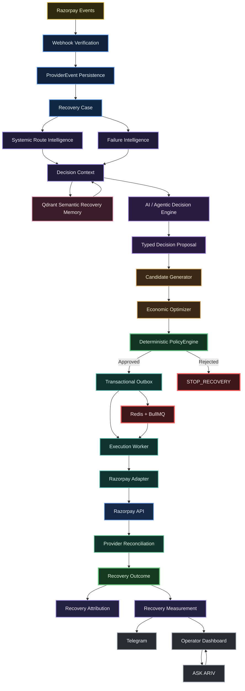

<div align="center">


# ARIV — Agentic Revenue Recovery for Razorpay


</div>

**Agentic AI** reasons, retrieves context, diagnoses failures, and proposes recovery actions.  
**Economic logic** ranks candidates.  
**PolicyEngine** authorizes financial actions.  
**Durable infrastructure** executes them.  
**Razorpay provider events** establish truth.  
**Attribution** determines recovered revenue.

> *“Agentic” describes the reasoning/workflow layer — not unrestricted authority over money movement.*

### 🎯 Core Promise

**Detect a failed payment. Decide the best recovery. Authorize it deterministically. Execute safely. Verify provider truth. Attribute the revenue. Measure the outcome.**

ARIV is a **revenue-recovery control plane for Razorpay** that turns failed payments into governed, observable, measurable workflows.

---

# 🏆 Buildathon Submission Summary

## Problem Solved

**Recover failed payments intelligently — not blindly retry everything.**

Payment failures are not a single problem. Some are transient, some require customer action, some are payment-method specific, and some should not be retried at all.

ARIV is built around one principle:

> **The right recovery action matters more than the number of retries.**

## Key Claims

- ✅ **Real Razorpay Test API integration** — not mocked provider execution.
- ✅ **Deterministic safety** — AI proposes; PolicyEngine authorizes.
- ✅ **No single layer moves money** — reasoning and financial authority are explicitly separated.
- ✅ **258/258 tests passing** — full stack reproducible locally with Docker Compose.
- ✅ **Honest benchmarking** — 100% decision coverage in the reported Test-Mode cohorts, with **0% verified recovery on failure-only cohorts** because customers did not complete those generated recovery links.
- ✅ **Economic optimization** — systemic route awareness + ENR ranking showed modeled improvement in the reported offline ablation.
- ✅ **Provider-confirmed recovery** — a separate real Razorpay Test-Mode customer-completed recovery was demonstrated end-to-end.

## Why ARIV Is Different

### 1. 🏗️ Architecture Trust

ARIV separates **judgment from authority**:

```text
AI
 ↓
PROPOSES

Economic Optimizer
 ↓
RANKS

PolicyEngine
 ↓
AUTHORIZES

Durable Execution
 ↓
EXECUTES

Razorpay
 ↓
ESTABLISHES PROVIDER TRUTH

Attribution
 ↓
COUNTS RECOVERED REVENUE
```

### 2. 📏 Honest Metrics

ARIV does **not** treat successful action creation as recovered revenue.

> **Action ≠ Payment ≠ Attributed Recovery**

Revenue is counted only after provider confirmation and recovery attribution.

### 3. 🚀 Production-Oriented Engineering

The system uses:

- durable persistence
- tenant isolation
- deterministic policy controls
- idempotent execution
- transactional outbox
- background workers
- provider reconciliation
- semantic memory
- reproducible local infrastructure

---

# 💻 Technology at a Glance

| Technology | Role in ARIV |
|---|---|
| **FastAPI** | Async APIs and webhook endpoints |
| **PostgreSQL** | Authoritative transactional state |
| **Redis** | Coordination and deduplication |
| **Qdrant** | Tenant-scoped semantic recovery memory |
| **LLM / OpenAI-compatible adapter** | Context-aware recovery reasoning |
| **PolicyEngine** | Deterministic financial authorization |
| **Transactional Outbox** | Durable side-effect boundary |
| **Execution Worker** | Idempotent background execution |
| **Razorpay Test APIs** | Provider-side Test-Mode execution |
| **Razorpay Webhooks** | Provider-side event truth |
| **Next.js / React** | Operator control surface |
| **Docker Compose** | Reproducible local environment |

---

# 🧠 Executive Summary

ARIV is designed as a closed-loop recovery system:

```text
Failed Payment
      ↓
Detect
      ↓
Diagnose
      ↓
Retrieve Context
      ↓
Propose Recovery
      ↓
Rank Economically
      ↓
Authorize Deterministically
      ↓
Execute Durably
      ↓
Verify Provider Truth
      ↓
Attribute Recovery
      ↓
Measure Outcome
```

The central architecture is:

```text
AI proposes
   ↓
Economic logic ranks
   ↓
PolicyEngine authorizes
   ↓
Infrastructure executes
   ↓
Razorpay confirms
   ↓
Attribution measures
```

ARIV therefore treats agentic AI as a **bounded reasoning layer**, not as an unrestricted financial authority.

---

# 🔄 End-to-End Recovery Loop

```text
Payment Failure
 → Detect (webhook → ProviderEvent → Recovery Case)
 → Diagnose (Failure Intelligence + Systemic Route Intelligence)
 → Retrieve Context (case history + Qdrant)
 → AI Decision (typed proposal)
 → Candidate Generation
 → Economic Ranking (ENR)
 → Policy Check (deterministic approval)
 → Controlled Execution (Outbox → Worker → Razorpay)
 → Provider Confirmation (webhook reconciliation)
 → Recovery Outcome
 → Attribution (action ↔ payment)
 → Measurement
 → Operator Visibility (Dashboard + Telegram + ASK ARIV)
```

Every stage is observable and auditable.

> **Creating an action is not recovering revenue.**

---

# 🧪 Verified Test-Mode Evidence

Two real Test-Mode benchmark runs exercised the actual ARIV pipeline against Razorpay Test APIs.

```text
Failure ingestion
      ↓
Decisioning
      ↓
Policy evaluation
      ↓
Provider execution
```

The metrics below are based on persisted pipeline state in PostgreSQL.

> ⚠️ These benchmark cohorts were designed to test ingestion, decisioning, policy behavior, and execution. They did **not** include customers completing the generated recovery links. Therefore verified recovery and attributed recovery are correctly reported as zero.

---

## Benchmark A — Test-Mode Execution-Scale Pipeline Benchmark

`benchmark_report_bench_20260907_041856_fa9508.json`

**25 cases · ₹35,232.60 at risk**

| Metric | Result |
|---|---|
| Cases decisioned | **25 / 25 (100%)** |
| Policy evaluations / approvals | **25 / 25** |
| Execution attempts | **25** |
| Provider payment-link actions completed | **24 / 25** |
| Real Razorpay failures | **1** (`RATE_LIMIT_EXCEEDED`) |
| Verified recoveries | **0** |
| Attributed recoveries | **0** |
| Revenue recovered | **₹0** |
| Recovery rate | **0%** |

---

## Benchmark B — Test-Mode Scenario-Diversity / Decision-Policy Benchmark

`benchmark_report_bench_20260907_045936_39bde5.json`

**18 cases · ₹145,400.00 at risk**

| Metric | Result |
|---|---|
| Cases decisioned | **18 / 18 (100%)** |
| `RETRY_NOW` | **4** |
| `GENERATE_PAYMENT_LINK` | **5** |
| `STOP_RECOVERY` | **9** |
| Policy approved / needs review | **16 / 2** |
| `FULL_AUTO` / `HUMAN_APPROVAL` | **16 / 2** |
| Execution attempts / provider actions | **5 / 5 completed** |
| Execution failures | **0** |
| Human escalations | **2** |
| Verified recoveries | **0** |
| Attributed recoveries | **0** |
| Revenue recovered | **₹0** |
| Recovery rate | **0%** |

Human-review scenarios included B2B mandate and route-degradation cases.

---

# 💰 Real Provider-Confirmed Recovery Demonstration

Separately from the benchmark cohorts, ARIV demonstrated a real Razorpay Test-Mode customer-completed recovery.

This recovery is intentionally kept **outside the benchmark denominators**.

```text
payment failure
      ↓
ARIV case
      ↓
recovery decision
      ↓
PolicyEngine
      ↓
recovery action
      ↓
customer payment
      ↓
Razorpay provider confirmation
      ↓
RECOVERED
      ↓
ACTION_ATTRIBUTED
      ↓
measurement
      ↓
Telegram
```

This is a **real provider-confirmed recovery demonstration**, not a claimed benchmark recovery rate.

---

# ⚖️ Evaluation Model

ARIV is designed to be evaluated against simpler strategies.

| Strategy | Behavior |
|---|---|
| **No intervention** | Do nothing after payment failure |
| **Naive retry** | Retry using a fixed retry strategy |
| **Rule-based recovery** | Apply static failure-code mappings |
| **ARIV** | Diagnose → Generate → Rank → Authorize → Execute → Verify → Attribute |

The objective is not:

> **maximize retries**

The objective is:

> **maximize expected net recovery within a deterministic safety envelope.**

---

# 🧮 Economic Optimization

ARIV ranks candidate recovery actions using **Expected Net Recovery (ENR)**.

Conceptually:

```text
ENR = Probability of Recovery × Recoverable Amount
      − Intervention Cost
      − Risk Penalty
```

This changes the optimization target from:

```text
"How many retries can we perform?"
```

to:

```text
"What action has the best expected financial value?"
```

The economic layer ranks candidates before deterministic policy authorization.

ENR ties are resolved deterministically so candidate ordering cannot create hidden model influence.

---

# 🧮 What the Offline Ablation Actually Found

The repository contains an **offline, modeled ablation** using:

```text
10 seeds
×
10,000 synthetic cases
×
frozen Phase-1 baseline
×
common random numbers
×
held-out evaluator truth
```

> ⚠️ These are **modeled / offline results**, not real-money causal measurements.

| Comparison | Result |
|---|---|
| Economic vs rules baseline | **Economic strategy wins** |
| AI + Economic vs Economic | AI did **not** improve modeled net recovery |
| + Qdrant vs AI + Economic | Qdrant did **not** improve modeled net recovery |
| + Systemic / route-aware layer | **Improved the modeled result** |
| Full stack vs Economic | Full stack did **not** outperform Economic |

### Engineering Takeaway

The result is deliberately reported rather than hidden.

The reported ablation indicates that:

- deterministic economic optimization was the strongest direct modeled recovery driver;
- AI did not improve modeled net recovery in the reported comparison;
- Qdrant did not improve modeled net recovery in the reported comparison;
- systemic / route-aware intelligence produced the modeled improvement observed in the sequence.

This reinforces ARIV's architectural philosophy:

> **AI does not need to own financial authority to be useful.**

See:

`artifacts/benchmarks/phase2_ablation_report.md`

for the detailed report.

---

# 🎯 What Problem ARIV Solves

Payment failures have different causes.

### Common categories

- **Transient provider glitches** — controlled retry may succeed.
- **Customer action required** — customer may need a new payment path.
- **Payment-method problems** — expired card, insufficient funds, etc.
- **Non-retriable / risky failures** — repeated action can be harmful or pointless.
- **Systemic route degradation** — individual retries may be inappropriate while a wider route is unhealthy.

Blind retrying everything can waste attempts, create unnecessary provider traffic, degrade customer experience, and increase risk.

ARIV therefore focuses on:

> **bounded, intelligently-selected, economically-ranked, measurable recovery.**

---

# 🏗️ Architecture



> The systems-integration boundary is a **typed capability / tool boundary**: a declared interface offering controlled, authorized actions to the decision and control layers — not a fully-fledged MCP server or an unrestricted agent-execution gateway.

---

# 🤖 Agentic AI Decision Layer

ARIV uses an **agentic reasoning layer** to:

- diagnose payment failures
- retrieve relevant recovery context
- evaluate candidate interventions
- produce structured recovery proposals
- explain decisions to operators

The agent does **not** authorize or directly execute financial actions.

```text
Agentic AI
    ↓
Typed Decision Proposal
    ↓
Candidate Generation
    ↓
Economic Ranking
    ↓
PolicyEngine
    ↓
Execution
```

## AI Is Advisory

- AI **proposes structured decisions**.
- AI does not own authoritative financial state.
- AI cannot bypass `PolicyEngine`.
- Model confidence is **not** recovery probability.
- Financial and provider-truth fields are not delegated to the model.
- Recovery probability and ENR are supplied by deterministic components.
- The real LLM adapter uses explicit timeouts.
- Deterministic fallback behavior is available if the model is unavailable.
- Fallback behavior still passes through policy.
- Decisions are represented as structured, typed proposals suitable for auditing.

> **AI is for judgment. Deterministic infrastructure is for authority.**

---

# 🧠 Qdrant Semantic Recovery Memory

Qdrant provides contextual semantic memory.

### Responsibilities

- tenant-scoped historical-case retrieval
- recovery precedent lookup
- contextual diagnosis
- historical outcome context
- semantic similarity
- tenant-isolated retrieval

Embedding support includes:

- OpenAI semantic embeddings
- deterministic hash fallback for offline and reproducible testing

The vector store is deliberately **not** the authoritative financial database.

```text
PostgreSQL
    ↓
Authoritative State

Qdrant
    ↓
Semantic Context
```

---

# 🛡️ PolicyEngine / Safety

The `PolicyEngine` is the **deterministic financial firewall**.

It is the only authority that can approve recovery actions.

### Policy responsibilities

- tenant limits
- action safety
- retry budgets
- autonomy tiers
- payment state
- route health
- action-specific constraints
- human-approval requirements
- candidate rejection
- `STOP_RECOVERY`

### Candidate evaluation

```text
Candidate Generator
        ↓
Economic Optimizer
        ↓
ENR ordering
        ↓
PolicyEngine
        ↓
Approved candidate
        OR
STOP_RECOVERY
```

When nothing is safe or economically justified:

```text
STOP_RECOVERY
```

Stopping is a valid recovery decision.

---

# 🔒 Durable Execution

Approved actions cross a **transactional outbox** before external side effects occur.

```text
Policy Approval
      ↓
Transactional Outbox
      ↓
Execution Worker
      ↓
Razorpay Adapter
      ↓
Razorpay API
```

The execution layer provides:

- idempotent processing
- worker leases
- durable execution intent
- state-transition guards
- crash-safe background execution
- protection against duplicate side effects

This separates:

```text
Decision
    ↓
Authorization
    ↓
Durable Intent
    ↓
Execution
```

---

# 🔴 Redis + BullMQ Coordination

Redis supports fast-path and queue-backed coordination.

It is used for:

- asynchronous workload coordination
- deduplication
- worker orchestration
- short-lived operational state

Redis is **not** the authoritative source of payment truth.

PostgreSQL remains the durable source of transactional state.

---

# 💳 Razorpay Integration & Provider Truth

ARIV integrates with Razorpay Test APIs and webhooks.

## Webhook Handling

- HMAC-SHA256 verification
- event-ID deduplication
- duplicate-event handling
- out-of-order event handling
- durable ProviderEvent persistence

## Test-Mode Execution

ARIV uses Razorpay Test APIs for supported recovery actions such as payment-link creation.

Execution then waits for provider confirmation.

```text
Recovery Action
      ↓
Razorpay
      ↓
payment_link.paid
      ↓
Provider Reconciliation
```

---

# 🔎 Provider Reconciliation

A local API success is not sufficient evidence of recovered revenue.

ARIV therefore separates:

```text
Action Created
      ↓
Provider Confirmation
      ↓
Recovery Attribution
```

The reconciliation layer correlates provider events with the originating recovery action.

This makes external provider truth the source for recovery confirmation.

---

# 📊 Attribution & Measurement

ARIV distinguishes three important states.

## 1. Action Succeeded

Example:

```text
Payment Link Created
```

This means the intervention was successfully executed.

It does **not** mean revenue was recovered.

## 2. Provider-Confirmed Payment

Example:

```text
Razorpay → PAID
```

This confirms that payment actually occurred.

## 3. Attributed Recovery

Example:

```text
ACTION_ATTRIBUTED
```

The confirmed payment is linked to the originating recovery action.

Only this state contributes to recovery revenue.

```text
Action succeeded
      ≠
Provider-confirmed payment
      ≠
Attributed recovery
```

This prevents false recovery claims.

> **No causal lift is claimed without controlled experiments.**

---

# 💬 ASK ARIV

**ASK ARIV** is a conversational operational control layer grounded in actual ARIV state.

It answers questions about:

- live cases
- failure diagnosis
- recovery decisions
- policy outcomes
- actions
- provider state
- attribution
- latest activity
- next steps

ASK ARIV is **not** a general-purpose autonomous agent with unrestricted financial authority.

It is a grounded operator interface over system state.

---

# 📡 Operator Visibility

## 🖥️ Dashboard

The operator dashboard exposes:

- active cases
- diagnosis
- decisions
- policy outcomes
- action state
- provider state
- recovery measurement
- system health

## 📲 Telegram

Important recovery activity can be surfaced to operators.

Example:

```text
RECOVERY VERIFIED
→ Provider confirmed
→ Action attributed
→ Revenue measured
→ Telegram notification
```

---

# 🏛️ Reliability & Engineering Invariants

Engineering problems explicitly addressed during implementation include:

- duplicate and out-of-order webhook delivery
- webhook signature verification
- request-scoped async session failures in background processing
- provider success-event correlation
- stale ORM state and concurrency handling
- tenant isolation hardening
- provider reconciliation correctness
- idempotent outbox execution
- worker leases
- state-machine transition guards
- Qdrant consistency
- case-detail endpoint reliability

---

# 🔐 Multi-Tenant & Security Model

ARIV is designed around tenant-isolated system state.

Controls include:

- tenant-aware database access
- tenant-scoped semantic retrieval
- signed request identity
- internal API protection
- webhook verification
- fail-closed tenant resolution
- environment-based secret isolation

Tenant context is part of the backend control path.

---

# 🧱 Core Architectural Invariants

```text
1. Provider events are verified and persisted.

2. Recovery cases are tenant-scoped.

3. AI output is advisory.

4. Economic ranking is deterministic.

5. PolicyEngine is the financial authorization boundary.

6. Approved actions pass through durable execution.

7. Execution is idempotent.

8. Provider success is reconciled against the originating action.

9. Recovery revenue requires provider-confirmed attribution.

10. Measurement does not silently convert actions into recoveries.
```

---

# 🧪 Tests

Run the full test suite:

```bash
docker compose exec web pytest -q
```

Current verified result:

```text
258 passed
1 skipped
0 failed
2 warnings
```

The two warnings are known runtime warnings in a tenant-bootstrap test and are not test failures.

---

# 🚀 Local Reproduction

You can fork ARIV, configure Razorpay Test Mode, and run the full stack locally with Docker Compose.

## 1. Fork

Repository:

https://github.com/praveen0767/ARIV

Use **Fork** to create your own copy.

## 2. Clone

```bash
git clone https://github.com/<your-username>/ARIV.git
cd ARIV
```

## 3. Configure Environment

```bash
cp .env.example .env
```

Configure:

- Razorpay Test Mode credentials
- webhook secret
- `TEST_MODE`

Telegram configuration is optional.

> 🔐 Never commit `.env`, API keys, webhook secrets, Telegram tokens, or other credentials.

## 4. Start the Stack

```bash
docker compose up -d --build
```

Check:

```bash
docker compose ps
```

Services:

```text
Frontend → http://localhost:3000
Backend  → http://localhost:8000
```

## 5. Run Tests

```bash
docker compose exec web pytest -q
```

---

# 📈 Reproduce the Test-Mode Benchmarks

## Benchmark A — 25 Cases

```bash
python scripts/run_benchmark.py --cases 25 --min 5000 --max 250000 \
  --webhook-url http://localhost:8000/webhooks/razorpay \
  --account-id acc_benchmark \
  --output-dir . \
  --poll-interval 3 \
  --max-wait 300
```

## Benchmark B — 18 Cases

```bash
python scripts/run_benchmark.py --scenario-file scripts/scenarios_mixed_18.json \
  --webhook-url http://localhost:8000/webhooks/razorpay \
  --account-id acc_benchmark \
  --output-dir . \
  --poll-interval 3 \
  --max-wait 300
```

---

# 🧮 Offline Strategy Benchmarks

Synthetic economic and judge harnesses remain available:

```bash
python scripts/run_economic_benchmark.py --cases 5 --seed 42
python scripts/run_judge_benchmark.py
```

Supporting documentation:

```text
docs/benchmark-results.md
docs/benchmark-summary.md
artifacts/benchmarks/phase2_ablation_report.md
```

---

# 🛑 Stop the Environment

```bash
docker compose down
```

For a fresh database:

```bash
docker compose down -v
```

---

| Stage | Screenshot | What it demonstrates |
|---|---|---|
| 01 |  | 🖥️ ARIV command center and system state |
| 02 |  | 💳 Failed payment entering the recovery workflow |
| 03 |  | 🤖 AI reasoning + deterministic PolicyEngine boundary |
| 04 |  | ⚙️ Governed recovery action |
| 05 |  | 💳 Real Razorpay Test-Mode payment flow |
| 06 |  | ✅ Provider-confirmed recovery + attribution |
| 07 |  | 📲 Recovery notification / operator visibility |
| 08 |  | 💬 Conversational operational control layer |
| 09 |  | 🧠 Semantic recovery memory |
| 10 |  | ❤️ Backend / infrastructure health |
| 11 |  | 📊 Recovery measurement and outcome visibility |

# 🎥 Product Walkthrough

The product walkthrough follows the same story:

```text
Failure Detection
→ AI Diagnosis
→ Context Retrieval
→ Recovery Decision
→ Economic Ranking
→ Policy Enforcement
→ Razorpay Execution
→ Provider Confirmation
→ Recovery Attribution
→ Measurement
→ Telegram
→ ASK ARIV
```

### ▶️ Video

https://www.youtube.com/watch?v=vkv6G-Nq67s

---

# 🆚 Why ARIV Is More Than a Retry Engine

A naive recovery system can look like:

```text
Payment Failed
      ↓
Retry
      ↓
Retry
      ↓
Retry
```

ARIV instead follows:

```text
Payment Failed
      ↓
Why did it fail?
      ↓
Is recovery possible?
      ↓
What recovery actions are candidates?
      ↓
Which has the best expected net value?
      ↓
Is it allowed by policy?
      ↓
Can it execute safely?
      ↓
Did Razorpay confirm payment?
      ↓
Can the payment be attributed?
      ↓
How much revenue was recovered?
```

That is the core product and engineering distinction.

---

# 🔬 Evidence Model

ARIV intentionally separates evidence types.

| Evidence | What it demonstrates |
|---|---|
| **258 tests** | Software behavior and regression coverage |
| **Real Razorpay Test APIs** | Provider integration |
| **100% decision coverage** | Decision-pipeline coverage in reported benchmark cohorts |
| **0% recovery in failure-only cohorts** | Honest measurement boundary |
| **Provider-confirmed recovery demo** | Real end-to-end recovery path |
| **Offline ablation** | Modeled layer comparison |
| **Systemic route improvement** | Modeled improvement in the reported sequence |
| **No causal-lift claim** | Avoids overstating evidence |

---

# ⚖️ What ARIV Does Not Claim

ARIV does **not** claim:

- ❌ 100% decision coverage means 100% recovery
- ❌ payment-link creation equals recovered revenue
- ❌ AI alone improves financial recovery
- ❌ Qdrant alone improves financial recovery
- ❌ offline synthetic results prove real-world causal lift
- ❌ one successful recovery demonstration represents a production recovery rate
- ❌ Test Mode performance equals production financial performance

Instead:

> **ARIV reports what each experiment actually demonstrates.**

---

# 🧭 Evaluation Philosophy

ARIV follows three principles.

## 1. Measure the full lifecycle

```text
Decision
→ Action
→ Provider Confirmation
→ Attribution
→ Revenue
```

not merely:

```text
Decision
→ Action
```

## 2. Separate modeled results from real provider evidence

```text
Offline synthetic evaluation
        ≠
Razorpay Test-Mode provider execution
        ≠
Production financial performance
```

Each is labeled according to what it actually proves.

## 3. Never manufacture a recovery number

When a failure-only benchmark has no customer-completed recovery:

```text
Verified Recovery = 0
```

ARIV reports zero rather than inventing or estimating a recovery rate.

---

# 🧩 Judge-Facing Architectural Invariants

The most important properties to inspect are:

```text
AI proposes
      ↓
Economic logic ranks
      ↓
PolicyEngine authorizes
      ↓
Outbox persists execution intent
      ↓
Worker executes
      ↓
Razorpay processes
      ↓
Provider event confirms
      ↓
Attribution links outcome
      ↓
Measurement counts revenue
```

The key safety property is:

> **No single component can both decide on money and independently move it.**

---

# 🏁 Final Takeaway

ARIV is a **revenue-recovery control plane for Razorpay**.

It combines:

- 🤖 Agentic AI reasoning
- 🧠 Semantic recovery memory
- 🧮 Economic optimization
- 🛡️ Deterministic financial policy
- 🔒 Durable execution
- 🔴 Redis coordination
- 💳 Real Razorpay Test APIs
- 🔎 Provider reconciliation
- 💰 Recovery attribution
- 📊 Outcome measurement
- 🖥️ Operator visibility
- 💬 ASK ARIV

The complete loop is:

```text
Detect
→ Diagnose
→ Retrieve
→ Propose
→ Rank
→ Authorize
→ Execute
→ Verify
→ Attribute
→ Measure
```

### The central idea

> **Don't blindly retry failed payments. Diagnose them, reason about them, rank recovery options economically, authorize them deterministically, execute them durably, verify them against provider truth, and only then count the revenue.**

**AI proposes. Economic logic ranks. PolicyEngine authorizes. Durable infrastructure executes. Razorpay establishes truth. Attribution measures the money.**

---

# 🚀 ARIV

**Detect · Diagnose · Retrieve · Propose · Rank · Authorize · Execute · Verify · Attribute · Measure**