<div align="center">


# ARIV — Agentic Revenue Recovery for Razorpay


**Detect → Diagnose → Retrieve → Propose → Rank → Authorize → Execute → Verify → Attribute → Measure**

**ARIV is an agentic revenue-recovery control plane for Razorpay.**

</div>

---

## 🏆 Buildathon Submission

**Problem:** Recover failed payments intelligently instead of blindly retrying everything.

ARIV turns a failed payment into a governed recovery workflow:

```text
Failure
  ↓
Diagnose
  ↓
Retrieve Context
  ↓
AI Proposal
  ↓
Economic Ranking
  ↓
Policy Authorization
  ↓
Durable Execution
  ↓
Razorpay Confirmation
  ↓
Attribution
  ↓
Measurement
```

### Implemented

- ✅ Real Razorpay Test API integration
- ✅ Deterministic financial safety — AI proposes; `PolicyEngine` authorizes
- ✅ No single AI component can independently move money
- ✅ 302 tests passing, 0 failed
- ✅ 100% decision coverage in both reported Test-Mode benchmark cohorts
- ✅ Honest recovery accounting — benchmark cohorts report **0 verified recoveries**
- ✅ Separate provider-confirmed customer recovery demonstrated in Razorpay Test Mode
- ✅ Economic optimization through ENR ranking
- ✅ Systemic / route-aware recovery intelligence
- ✅ Durable execution with transactional outbox and worker leases
- ✅ Attribution only after provider confirmation

> **AI reasons. Economic logic ranks. PolicyEngine authorizes. Infrastructure executes. Razorpay confirms. Attribution measures.**

---

## 💡 What ARIV Does

A failed payment is not automatically a retry candidate.

ARIV evaluates the failure, gathers context, proposes recovery actions, ranks them economically, applies deterministic policy controls, executes approved actions, and waits for provider confirmation before counting recovered revenue.

```text
Razorpay Failure
      ↓
Webhook Verification
      ↓
ProviderEvent Persistence
      ↓
Recovery Case
      ↓
Failure + Systemic Route Intelligence
      ↓
Decision Context + Qdrant Memory
      ↓
AI / Agentic Proposal
      ↓
Candidate Generation
      ↓
Economic Optimization (ENR)
      ↓
Deterministic PolicyEngine
      ↓
Transactional Outbox
      ↓
Execution Worker
      ↓
Razorpay
      ↓
Provider Reconciliation
      ↓
Recovery Outcome
      ↓
Attribution + Measurement
```

### The key invariant

```text
Action Success
      ≠
Payment Success
      ≠
Attributed Recovery
```

Revenue is counted only after provider-confirmed payment and recovery attribution.

---

## 🏗️ Architecture

```mermaid
flowchart TD
    %% 1. PROVIDER / INGESTION
    subgraph S_INGEST ["1. PROVIDER / INGESTION"]
        RP["Razorpay Events\n(Webhook Failures)"]
        WH["Webhook Verification\n(Tenant Isolation + HMAC Auth)"]
        PE["ProviderEvent Persistence\n(Authoritative Raw Audit)"]
    end

    %% 2. CASE + INTELLIGENCE
    subgraph S_CASE ["2. CASE & ROUTE INTELLIGENCE"]
        C["Recovery Case\n(State Machine & Lifecycle)"]
        FI["Failure Intelligence\n(Classification & Root Cause)"]
        SYS["Systemic Route Intelligence\n(Corridor Degradation Signals)"]
        DC["Decision Context\n(Unified Recovery State)"]
    end

    %% 3. MEMORY & CLOSED-LOOP LEARNING
    subgraph S_MEM ["3. SEMANTIC MEMORY & LEARNING"]
        QDRANT[("Qdrant\nSemantic Recovery Memory")]
        LEARN["Recovery Learning Service\n(Dirichlet-Smoothed Precedents)"]
        KOUT["Knowledge Outbox\n(Durable Vector Indexing Queue)"]
    end

    %% 4. AGENTIC DECISIONING
    subgraph S_AI ["4. AGENTIC DECISIONING"]
        AI["AI / Agentic Decision Engine\n(Context & Strategy Formulation)"]
        PROP["Typed Decision Proposal\n(Recommended Action Proposal)"]
    end

    %% 5. ECONOMIC CONTROL
    subgraph S_ECON ["5. ECONOMIC CONTROL"]
        GEN["Candidate Generator\n(Action Space Exploration)"]
        ECON["Economic Optimizer (ENR)\nExpected Net Recovery Ranking"]
    end

    %% 6. POLICY AUTHORIZATION
    subgraph S_POL ["6. POLICY AUTHORIZATION"]
        POL["Deterministic PolicyEngine\nSafety Rules & Domain Constraints"]
        STOP["STOP_RECOVERY\n(Suppression / Terminal Exit)"]
    end

    %% 6b. MCP / TOOL CONTROL RUNTIME
    subgraph S_MCP ["6b. MCP / TOOL CONTROL RUNTIME (MCPToolGateway)"]
        TR["MCPToolRegistry\n(Tool Lookup & Registration)"]
        TV["Input Schema Validation\n(JSON Schema + Required Fields)"]
        TI["Tenant & Case Ownership\n(Isolation Enforcement)"]
        RC["Server-Side Risk Classification\nToolRiskClassification: READ | FINANCIAL"]
        EC["ExecutionControlService\n(DB-backed Kill Switch — Fail-Closed)"]
        AUDIT["AuditEvent Trail\n(Sanitized Credential-Free Audit Log)"]
    end

    %% 7. DURABLE EXECUTION
    subgraph S_EXEC ["7. DURABLE EXECUTION"]
        OUT["Transactional Outbox\nOutboxService.create_authorized_action"]
        GATE["18-Point Preflight Safety Gate\n(Kill Switch & Tenant Validation)"]
        WK["Execution Worker\n(Durable Action Dispatcher)"]
        AD["Razorpay Adapter\n(Typed Provider Interface)"]
    end

    %% 8. PROVIDER RECONCILIATION
    subgraph S_RECON ["8. PROVIDER RECONCILIATION"]
        RPI["Razorpay API\n(Test Mode Financial Mutations)"]
        RECON["Provider Reconciliation\n(State Verification & Settlement)"]
    end

    %% 9. OUTCOME / MEASUREMENT
    subgraph S_MEAS ["9. OUTCOME & MEASUREMENT"]
        OC["Recovery Outcome\n(Terminal State: Success / Failed)"]
        ATTR["Recovery Attribution\n(Exact Ledger Match Verification)"]
        MEAS["Recovery Measurement\n(Financial & Health Metrics)"]
    end

    %% 10. OPERATOR EXPERIENCE
    subgraph S_OPS ["10. OPERATOR EXPERIENCE"]
        UI["Operator Dashboard\n(Real-Time Analytics & Live Stream)"]
        ASK["ASK ARIV\n(Natural Language Agent — Streaming)"]
        TG["Telegram Notifier\n(Critical Outage & Action Alerts)"]
    end

    %% 11. INFRASTRUCTURE / COORDINATION
    subgraph S_INFRA ["11. INFRASTRUCTURE & COORDINATION"]
        PG[("PostgreSQL\nAuthoritative Operational State")]
        REDIS[("Redis\nCoordination / Queue")]
    end

    %% Core Forward Flow
    RP --> WH
    WH --> PE
    PE --> C
    C --> FI
    C --> SYS
    FI --> DC
    SYS --> DC

    %% Memory to Decision Context
    QDRANT -.->|Precedents & Playbooks| DC

    %% Decisioning & Economics
    DC --> AI
    AI --> PROP
    PROP --> GEN
    GEN --> ECON
    LEARN -.->|Corridor Priors| ECON

    %% Policy Gate
    ECON --> POL
    POL -->|Rejected / Suppressed| STOP

    %% MCP Tool Runtime Control Plane
    POL -->|Approved — ToolInvocation| TR
    TR --> TV
    TV --> TI
    TI --> RC
    RC -->|FINANCIAL: PolicyEngine Revalidation + Kill Switch| EC
    RC -->|READ: Synchronous Provider Query| AD
    EC -->|Enabled| OUT
    EC -->|Disabled — BLOCKED| AUDIT

    %% Durable Execution
    OUT --> WK
    WK --> GATE
    GATE -->|Safety Revalidated| AD
    AD --> RPI
    RPI --> RECON
    RECON --> OC

    %% Audit trail after every MCP outcome
    TR -.->|TOOL_NOT_FOUND| AUDIT
    TV -.->|INVALID_INPUT| AUDIT
    TI -.->|TENANT_FORBIDDEN| AUDIT
    OUT -.->|Action + Outbox Created| AUDIT
    WK -.->|Execution Result| AUDIT

    %% Outcome & Attribution
    OC --> ATTR
    ATTR --> MEAS

    %% Closed-Loop Feedback
    OC -.->|Terminal Outcomes| LEARN
    MEAS -.->|Post-Settlement Enqueue| KOUT
    KOUT -.->|Durable Indexer Worker| QDRANT

    %% Operator Experience & Alerts
    MEAS -.-> UI
    MEAS -.-> TG
    UI <--> ASK
    ASK -.->|MCPToolGateway.invoke| TR

    %% Queue & Leases
    REDIS -.->|Coordination / Leases| WK
    OUT -.-> REDIS

    %% Authoritative Persistence Backbone Links
    PG -.- PE
    PG -.- C
    PG -.- OUT
    PG -.- OC
    PG -.- MEAS
    PG -.- KOUT
    PG -.- AUDIT

    %% Styling & Class Definitions
    classDef provider fill:#3B3518,stroke:#E0B93F,color:#FFF4C2,stroke-width:2px;
    classDef ingestion fill:#172B45,stroke:#5B9BFF,color:#DCEBFF,stroke-width:2px;
    classDef case_intel fill:#1E2246,stroke:#7B88FF,color:#E6EAFF,stroke-width:2px;
    classDef memory fill:#452538,stroke:#E08AA5,color:#FFE8F0,stroke-width:2px;
    classDef agentic fill:#30244C,stroke:#A88BE8,color:#F1E9FF,stroke-width:2px;
    classDef economics fill:#49371E,stroke:#D9A65A,color:#FFF0D2,stroke-width:3px;
    classDef policy fill:#193D2B,stroke:#68C28A,color:#DDF8E7,stroke-width:3px;
    classDef tool_mcp fill:#143D3B,stroke:#4ED0C0,color:#D7FAF5,stroke-width:3px;
    classDef mcp_internal fill:#0E3030,stroke:#2EC4B6,color:#CCFAF5,stroke-width:2px;
    classDef outbox fill:#163D3A,stroke:#59BDB1,color:#D9F8F4,stroke-width:3px;
    classDef execution fill:#163D3A,stroke:#59BDB1,color:#D9F8F4,stroke-width:2px;
    classDef reconciliation fill:#183D32,stroke:#65C69A,color:#DDF9EC,stroke-width:2px;
    classDef outcome fill:#1B4228,stroke:#6BC982,color:#DDF9E2,stroke-width:3px;
    classDef measurement fill:#2C2850,stroke:#9889DE,color:#EEE9FF,stroke-width:2px;
    classDef operator fill:#303238,stroke:#9298A5,color:#F0F2F5,stroke-width:2px;
    classDef postgres fill:#1C2E3D,stroke:#6897BB,color:#D9E8F5,stroke-width:2.5px;
    classDef redis fill:#4A2022,stroke:#E05A5A,color:#FFE3E3,stroke-width:2.5px;
    classDef stop fill:#4A2022,stroke:#E05A5A,color:#FFE3E3,stroke-width:2.5px;
    classDef audit fill:#2A1E3A,stroke:#B07AD0,color:#F0E6FF,stroke-width:2px;

    class RP,RPI provider;
    class WH,PE ingestion;
    class C,FI,SYS,DC case_intel;
    class QDRANT,LEARN,KOUT memory;
    class AI,PROP agentic;
    class GEN,ECON economics;
    class POL policy;
    class TR,TV,TI,RC,EC tool_mcp;
    class STOP stop;
    class OUT outbox;
    class GATE,WK,AD execution;
    class RECON reconciliation;
    class OC outcome;
    class ATTR,MEAS measurement;
    class UI,ASK,TG operator;
    class PG postgres;
    class REDIS redis;
    class AUDIT audit;
```



> **Architectural boundary:** Probabilistic reasoning proposes actions; deterministic policy and tool controls constrain execution; durable workers perform approved operations; Razorpay confirms the financial outcome.

### Control-plane invariant

- **AI reasons.** Context & strategy formulation.
- **Economic logic ranks.** Expected Net Recovery (ENR) prioritization.
- **PolicyEngine authorizes.** Deterministic financial safety rules & domain constraints.
- **MCPToolGateway enforces the tool control boundary.** Every tool invocation (`ToolInvocation`) is processed through a multi-stage pipeline:
  1. **MCPToolRegistry lookup** — tool must be registered, unknown tools are rejected
  2. **Input schema validation** — required fields enforced against JSON schema
  3. **Tenant & case ownership verification** — strict tenant isolation, no cross-tenant access
  4. **Server-side `ToolRiskClassification`** — READ vs FINANCIAL, cannot be downgraded by caller
  5. **PolicyEngine revalidation** — approved decision re-evaluated at execution time
  6. **`ExecutionControlService` kill switch** — DB-backed, fail-closed; blocked = `BLOCKED` result
  7. **`OutboxService.create_authorized_action`** — durable outbox record committed before execution
  8. **Sanitized `AuditEvent`** — credential-free audit log written after every invocation outcome
- **Durable workers execute.** `ExecutionWorker.process_outbox_item` performs provider dispatch with PostgreSQL row-lock leasing.
- **Razorpay confirms.** Real payment provider settlement.
- **Attribution measures.** Ledger-matched revenue verification.
- **Qdrant retains semantic recovery memory.** Asynchronous closed-loop learning from verified outcomes.

---

## 🤖 Decisioning

ARIV separates reasoning, economics, authorization, execution, and provider truth.

| Layer | Responsibility |
|---|---|
| **AI / Agentic** | Diagnose failure, retrieve context, propose candidates |
| **Economic Optimizer** | Rank candidates using Expected Net Recovery (ENR) |
| **PolicyEngine** | Deterministic financial authorization & domain safety |
| **MCPToolGateway** | `MCPToolRegistry` lookup → input validation → tenant isolation → `ToolRiskClassification` → PolicyEngine revalidation → `ExecutionControlService` kill switch → `AuditEvent` trail |
| **Outbox + Worker** | `OutboxService.create_authorized_action` + `ExecutionWorker.process_outbox_item` (PostgreSQL row-locked durable execution) |
| **Razorpay** | Provider execution + confirmation |
| **Attribution** | Exact ledger linkage & recovery measurement |
| **Semantic Memory** | Qdrant vector memory + Dirichlet-smoothed learning loop |

### Expected Net Recovery

```text
ENR = P(recovery) × amount − cost − risk
```

AI confidence is **not** treated as recovery probability, and AI cannot bypass `PolicyEngine`.

---

# 🧪 Verified Test-Mode Evidence

ARIV was evaluated using **real Razorpay Test Mode**, because a student project does not operate on a production merchant payment stream.

The evaluation therefore separates three kinds of evidence:

```text
1. Pipeline / decision validation
       ↓
2. Real provider execution validation
       ↓
3. Complete customer-paid recovery validation
```

This distinction is intentional.

> **No production-money recovery rate is claimed. No benchmark action is counted as recovered revenue unless Razorpay confirms the payment and ARIV attributes it.**

---

## Benchmark A — Execution Scale

**25 cases · ₹35,232.60 at risk**

| Metric | Result |
|---|---:|
| Cases decisioned | **25 / 25 (100%)** |
| Policy evaluations / approvals | **25 / 25** |
| Execution attempts | **25** |
| Provider payment-link actions | **24 / 25** |
| Real Razorpay failures | **1** (`RATE_LIMIT_EXCEEDED`) |
| Verified recoveries | **0** |
| Attributed recoveries | **0** |
| Revenue recovered | **₹0** |
| Recovery rate | **0%** |

### What this benchmark proves

The cohort validates the production-shaped recovery pipeline from:

```text
Razorpay Failure
    ↓
Decision
    ↓
Policy
    ↓
Execution
    ↓
Provider Interaction
```

It does **not** claim customer-completed recovery for all generated actions.

---

## Benchmark B — Scenario Diversity

**18 cases · ₹145,400 at risk**

| Metric | Result |
|---|---:|
| Cases decisioned | **18 / 18 (100%)** |
| `RETRY_NOW` | **4** |
| `GENERATE_PAYMENT_LINK` | **5** |
| `STOP_RECOVERY` | **9** |
| Policy approved / review | **16 / 2** |
| `FULL_AUTO` / `HUMAN_APPROVAL` | **16 / 2** |
| Execution attempts | **5** |
| Provider actions completed | **5 / 5** |
| Execution failures | **0** |
| Human escalations | **2** |
| Verified recoveries | **0** |
| Attributed recoveries | **0** |
| Revenue recovered | **₹0** |
| Recovery rate | **0%** |

### Why 0% recovery?

The benchmark cohorts primarily exercised:

```text
Failure
  ↓
Decision
  ↓
Policy
  ↓
Execution
```

They did not include customers subsequently completing every generated recovery link.

Therefore:

```text
Action created ≠ Revenue recovered
```

ARIV reports **0 verified recoveries** instead of converting successful action execution into a financial outcome.

That is a measurement boundary, not a fabricated success metric.

---

# ✅ Real Provider-Confirmed Recovery

Separate from the benchmark denominators, ARIV demonstrated a complete customer-paid recovery in Razorpay Test Mode.

```text
Payment Failure
      ↓
Recovery Case
      ↓
Recovery Decision
      ↓
Policy Approval
      ↓
Recovery Action
      ↓
Customer Payment
      ↓
Razorpay Confirmation
      ↓
RECOVERED
      ↓
ACTION_ATTRIBUTED
      ↓
Measurement
      ↓
Telegram
```

The recovery produced a real provider-confirmed outcome of:

**₹100 recovered**

with:

```text
Case: ec60fb5d
Outcome: RECOVERED
Attribution: ACTION_ATTRIBUTED
```

This is intentionally reported **separately from the benchmark cohorts**.

It proves the complete end-to-end recovery path:

```text
Failure → Decision → Action → Customer Payment → Provider Confirmation → Attribution
```

It is **not presented as a statistically significant recovery-rate experiment**.

---

# 🧮 Offline Ablation

The repository also contains an offline modeled ablation using:

**10 seeds × 10,000 synthetic cases**

| Comparison | Result |
|---|---|
| Economic vs Rules | **Economic strategy wins** |
| AI + Economic vs Economic | AI did **not** improve modeled net recovery |
| + Qdrant vs AI + Economic | Qdrant did **not** improve modeled net recovery |
| + Systemic / Route Intelligence | **Improved modeled result** |
| Full Stack vs Economic | Full stack did **not** outperform Economic |

> These are **offline modeled findings**, not real-money causal measurements.

The result is important because it prevents an easy but misleading conclusion that “adding AI automatically improves recovery.”

In this evaluation, the deterministic economic layer and systemic route intelligence produced the modeled gains observed. The AI and Qdrant layers did not demonstrate incremental modeled recovery improvement.

That result is intentionally left visible.

---

# 📊 Attribution & Measurement

ARIV keeps recovery states separate:

```text
Action succeeded
      ↓
Provider confirmed payment
      ↓
Attributed recovery
```

Only the final state contributes to recovery revenue.

```text
Action Success
      ≠
Payment Success
      ≠
Attributed Recovery
```

This prevents:

- counting payment-link creation as revenue
- counting execution success as payment success
- claiming gross recovery when causality is unknown
- mixing Test-Mode demonstration results into batch benchmark denominators

---

## 📸 Product Proof

<p align="center">
  
</p>

<p align="center">
  <b>01 — Command Center</b><br/>
  Command center + live system state
</p>

<p align="center">
  
</p>

<p align="center">
  <b>02 — Failed Payment Case</b><br/>
  Failed payment → recovery case
</p>

<p align="center">
  
</p>

<p align="center">
  <b>03 — AI Decision + Policy</b><br/>
  AI proposal + deterministic PolicyEngine boundary
</p>

<p align="center">
  
</p>

<p align="center">
  <b>04 — Recovery Action</b><br/>
  Governed recovery action
</p>

<p align="center">
  
</p>

<p align="center">
  <b>05 — Razorpay Test Payment</b><br/>
  Real Razorpay Test-Mode payment
</p>

<p align="center">
  
</p>

<p align="center">
  <b>06 — Recovered + Attributed</b><br/>
  Provider-confirmed recovery + attribution
</p>

<p align="center">
  
</p>

<p align="center">
  <b>07 — Telegram Recovery</b><br/>
  Recovery notification
</p>

<p align="center">
  
</p>

<p align="center">
  <b>08 — ASK ARIV</b><br/>
  Conversational operator control
</p>

<p align="center">
  
</p>

<p align="center">
  <b>09 — Qdrant Memory</b><br/>
  Semantic recovery memory
</p>

<p align="center">
  
</p>

<p align="center">
  <b>10 — System Health</b><br/>
  Infrastructure health
</p>

<p align="center">
  
</p>

<p align="center">
  <b>11 — Measurement</b><br/>
  Recovery measurement
</p>

### Product Flow

```text
01 Command Center
      ↓
02 Failed Payment Case
      ↓
03 AI Decision + Policy
      ↓
04 Recovery Action
      ↓
05 Razorpay Test Payment
      ↓
06 Recovered + Attributed
      ↓
07 Telegram
      ↓
08 ASK ARIV
      ↓
09 Qdrant Memory
      ↓
10 System Health
      ↓
11 Measurement
```

---

# 🔒 Reliability & Safety

Key engineering safeguards:

- HMAC-SHA256 webhook verification
- Duplicate and out-of-order provider-event handling
- Durable `ProviderEvent` persistence
- Tenant-isolated semantic retrieval
- Deterministic `PolicyEngine`
- Transactional Outbox
- Worker leases and idempotent execution
- Optimistic locking
- State-machine guards
- Provider reconciliation before attribution
- Request-safe background database sessions
- Deterministic fallback when the LLM is unavailable
- Explicit human-approval path
- Recovery kill switch

### Core invariant

```text
AI proposes
    ↓
Economic layer ranks
    ↓
PolicyEngine decides
    ↓
Outbox persists
    ↓
Worker executes
    ↓
Razorpay confirms
    ↓
ARIV attributes
```

No LLM is granted direct authority to move money.

---

# 🧱 Failure Intelligence

ARIV normalizes payment failures into recovery-relevant categories:

```text
TRANSIENT_TECHNICAL
CUSTOMER_ACTION_REQUIRED
PAYMENT_METHOD_PROBLEM
PROVIDER_DEGRADATION
MERCHANT_CONFIGURATION
RISK_OR_FRAUD
NON_RETRIABLE
UNKNOWN
```

The normalized failure taxonomy feeds:

- retry eligibility
- recoverability
- action generation
- route/systemic intelligence
- economic ranking
- policy evaluation

The system distinguishes:

```text
Transient failure
      ≠
Customer-action failure
      ≠
Dead payment rail
      ≠
Non-retriable failure
```

This prevents blind retry behavior.

---

# 🧠 Systemic / Route Intelligence

Recovery should not always operate at the individual-payment level.

ARIV also looks for systemic signals such as:

- provider degradation
- payment-route failures
- method-specific failures
- repeated failure clusters
- retry patterns suggesting a dead rail

The objective is to recognize situations where:

```text
More retries
      ↓
More failures
      ↓
More cost
      ↓
More customer friction
```

and instead move toward:

```text
Detect systemic issue
      ↓
Reduce futile actions
      ↓
Wait / route / escalate
```

---

# 💰 Economic Optimization

Candidate actions are evaluated economically rather than by “retry everything.”

Example:

```text
Candidate A
Retry Now
P(recovery) × amount − cost − risk

Candidate B
Payment Link
P(recovery) × amount − cost − risk

Candidate C
Wait
Expected future value − delay cost

Candidate D
Stop
Avoided cost − forgone recovery
```

The optimizer allows ARIV to choose:

```text
RECOVER
WAIT
ESCALATE
STOP
```

instead of assuming every failure should trigger intervention.

---

# 🧾 Auditability

Important decisions are persisted as structured records.

ARIV preserves the distinction between:

```text
Provider Event
      ↓
Recovery Case
      ↓
Decision
      ↓
Policy Evaluation
      ↓
Execution
      ↓
Provider Outcome
      ↓
Attribution
      ↓
Measurement
```

This creates a traceable chain from the original provider event to the final measured outcome.

---

# 📡 Provider Integration

The Razorpay adapter provides controlled capabilities including:

- create payment link
- fetch payment
- fetch payment link
- cancel payment link

The implementation uses Razorpay Test Mode for real provider interaction.

Provider execution is therefore not represented as a mock-only abstraction.

The system still keeps provider truth authoritative:

```text
ARIV says action executed
          ↓
Razorpay says payment succeeded
          ↓
ARIV counts recovery
```

---

# 🧩 Technology Stack

### Backend

- Python
- FastAPI
- SQLAlchemy 2 async
- PostgreSQL
- Redis
- Qdrant
- Docker Compose

### Frontend

- Next.js
- React
- TypeScript
- Tailwind CSS
- shadcn/ui
- React Query
- Recharts
- Lucide

### Integrations

- Razorpay Test APIs
- Razorpay Webhooks
- Telegram
- Cloudflare Quick Tunnel

### Engineering

- Durable execution outbox
- Worker leases
- Idempotency
- Optimistic locking
- State-machine guards
- HMAC verification
- Semantic retrieval
- Policy engine
- Measurement / attribution

---

# 🚀 Run Locally

### 1. Clone

```bash
git clone https://github.com/praveen0767/ARIV.git
cd ARIV
```

### 2. Configure environment

```bash
cp .env.example .env
```

Configure the required database, Redis, Qdrant, Razorpay Test Mode, authentication, and notification settings in `.env`.

### 3. Start infrastructure

```bash
docker compose up --build
```

### 4. Start the application

Run the backend and frontend according to the repository development configuration.

The system is designed to operate with deterministic fallback behavior when the LLM is unavailable.

### 5. Run the complete local recovery demo (ONE command)

```bash
python scripts/run_test_recovery.py --amount 100
```

This is the recommended single demo command. It drives the **existing** pipeline
end to end through a real webhook and never touches production auth:

1. Creates a legitimate Razorpay `payment.failed` test event (`BAD_REQUEST_ERROR` /
   "Insufficient balance") signed with the webhook secret, for the demo account
   (`acc_demo_123`).
2. The running backend ingests it through `POST /webhooks/razorpay` → ProviderEvent → **Recovery Case**.
3. Decisioning runs the real AI/deterministic baseline → **Economic Optimization (ENR)** →
   **PolicyEngine** gate → outbox → Execution Worker.
4. When `GENERATE_PAYMENT_LINK` is approved (it is, for this scenario), the worker
   creates a **real Razorpay Test-Mode payment link** tied to the case.
5. The command prints: scenario/payment ID, case ID (with frontend URL), selected
   decision, economic ranking summary, policy result, and the payment link.

```bash
python scripts/run_test_recovery.py --amount 250 --description "ARIV Test Recovery"
```

- The amount is specified in rupees (`--amount 100` = ₹100). `--description` labels the test event.
- Nothing is fabricated: the case is **never marked RECOVERED** — a real `payment_link.paid`
  webhook is still required before ARIV counts any recovery. You can verify the new case
  immediately in the frontend at `http://localhost:3000/cases` (the demo-account proxy shows it).
- Credentials remain server-side in `.env` and are reused by the existing Razorpay adapter;
  the command never prints secrets.

For just the low-level provider step (a standalone payment link with no Recovery Case),
the building block is:

```bash
python scripts/create_test_payment_link.py --amount 100
```

That command only proves provider integration; use `run_test_recovery.py` when you want a
Recovery Case + decision + policy gate + payment link in one shot.

---

# 🧪 Reproduce the Benchmarks

The benchmark runner uses the existing recovery pipeline rather than directly fabricating database outcomes.

```bash
python scripts/run_benchmark.py
```

The benchmark:

1. Creates unique failure events
2. Sends them through the webhook ingestion path
3. Varies payment amounts
4. Exercises decisioning
5. Evaluates policy
6. Exercises durable execution
7. Polls persisted database state
8. Computes metrics from stored outcomes
9. Writes a benchmark report

Example output artifacts:

```text
benchmark_report_<id>.json
```

### Benchmark integrity rules

```text
No direct DB outcome injection
No historical-data mutation
No policy bypass
No fake successful payments
No fabricated recovery numbers
No conversion of action attempts into recovered revenue
```

---

# 📁 Repository Structure

```text
ARIV/
├── app/
│   ├── api/
│   ├── core/
│   ├── db/
│   ├── models/
│   ├── schemas/
│   ├── services/
│   └── workers/
│
├── frontend/
│   ├── app/
│   ├── components/
│   └── ...
│
├── scripts/
│   ├── run_benchmark.py
│   └── benchmark_utils.py
│
├── tests/
│
├── docs/
│   └── screenshots/
│
├── .env.example
├── Dockerfile
├── docker-compose.yml
└── README.md
```

---

# 🎬 Product Walkthrough

The intended operator journey is:

```text
Razorpay Failure
      ↓
Command Center
      ↓
Open Recovery Case
      ↓
Understand Failure
      ↓
Inspect AI Decision
      ↓
Inspect Policy Boundary
      ↓
Approve / Execute
      ↓
Razorpay Test Interaction
      ↓
Provider Confirmation
      ↓
Recovery Attribution
      ↓
Telegram Notification
      ↓
ASK ARIV Investigation
      ↓
Measurement
```

---

# 🎯 What ARIV Actually Proves

ARIV makes a deliberate distinction between what can be demonstrated in a student environment and what requires production-scale payment traffic.

### Proven in the build

```text
Real Razorpay webhook ingestion
        ↓
Failure classification
        ↓
Recovery case creation
        ↓
AI / rule-based decisioning
        ↓
Economic ranking
        ↓
Deterministic policy authorization
        ↓
Durable execution
        ↓
Real Razorpay Test API interaction
        ↓
Provider reconciliation
        ↓
Recovery attribution
        ↓
Measured outcome
```

### Demonstrated end-to-end

```text
Failed payment
      ↓
Recovery action
      ↓
Customer completes payment
      ↓
Razorpay confirms payment
      ↓
ARIV marks RECOVERED
      ↓
ARIV marks ACTION_ATTRIBUTED
```

### Not claimed

```text
Production merchant recovery rate
Production GMV lift
Statistically significant real-money causal lift
Large-scale customer-level recovery performance
```

Those require a real production transaction population or a properly instrumented experimental environment.

---

# 🧠 Engineering Takeaway

The central design decision in ARIV is simple:

> **Do not give an AI agent unrestricted authority over money.**

Instead:

```text
AI
↓
Judgment

Economic Optimizer
↓
Financial ranking

PolicyEngine
↓
Deterministic authorization

Outbox + Worker
↓
Durable execution

Razorpay
↓
Provider truth

Attribution
↓
Financial measurement
```

And the central measurement decision is equally important:

> **Do not call an attempted recovery a recovered payment.**

ARIV reports what it can prove, separates Test-Mode demonstrations from benchmark denominators, and keeps modeled evaluation distinct from real provider-confirmed outcomes.

That is the standard the system is designed around:

```text
Build honestly
Measure honestly
Fail honestly
Recover only when proven
```

---

<div align="center">

### ARIV

**Agentic recovery intelligence for Razorpay**

**Detect → Decide → Govern → Execute → Verify → Attribute**

</div>