# ARIV — Agentic Revenue Recovery for Razorpay

<p align="center">
  
</p>

<p align="center">
  <strong>Detect revenue risk. Decide the recovery. Enforce policy. Execute safely. Verify the outcome. Attribute the revenue.</strong>
</p>

<p align="center">
  <a href="#architecture">
    
  </a>
  <a href="#ai--agentic-system">
    
  </a>
  <a href="#qdrant-semantic-recovery-memory">
    
  </a>
  <a href="#mcp-tool-boundary">
    
  </a>
  <a href="#real-end-to-end-recovery">
    
  </a>
  <a href="#recovery-attribution--measurement">
    
  </a>
  <a href="#ask-ariv">
    
  </a>
  <a href="#engineering-reliability">
    
  </a>
  <a href="#local-development">
    
  </a>
</p>

---

# Executive Overview

**ARIV (Autonomous Revenue Intelligence & Recovery)** is an **agentic revenue-recovery control plane built around Razorpay**.

When a payment enters a risky state, ARIV does more than recommend a retry.

It:

> **detects → diagnoses → retrieves context → reasons → proposes an intervention → enforces deterministic policy → executes through a durable workflow → waits for provider truth → verifies recovery → attributes recovered revenue → measures impact → notifies operators**

The central design principle is:

> **AI proposes. Policy authorizes. Infrastructure executes. Provider events establish truth.**

ARIV is therefore designed as a **financial workflow system with an AI decision layer**, rather than an LLM wrapped around a payment API.

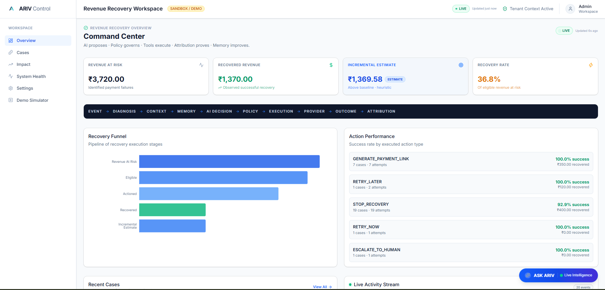

---

# Why ARIV?

Payment failure is not a single problem.

A transient provider failure may justify a controlled retry.

A customer-action failure may require a new payment method or a recovery payment link.

A non-retriable condition may require stopping recovery.

An uncertain failure may require human escalation.

ARIV converts these different failure states into **bounded recovery strategies instead of blindly retrying everything**.

## ARIV closes the loop

```text
Payment Failure
      ↓
Revenue Risk Detection
      ↓
Failure Intelligence
      ↓
Context + Semantic Memory
      ↓
AI / Agentic Decision
      ↓
Deterministic Policy Firewall
      ↓
Authorized Action
      ↓
Transactional Outbox
      ↓
Execution Worker
      ↓
Razorpay
      ↓
Provider Confirmation
      ↓
Recovery Attribution
      ↓
Measurement
      ↓
Operational Notification
```

---

# What ARIV Builds

ARIV is a closed-loop revenue-recovery control system composed of several cooperating layers.

| Layer | Responsibility |
|---|---|
| Revenue Risk Detection | Detect failed/risky payment states and create durable recovery cases |
| Failure Intelligence | Normalize failures into actionable recovery categories |
| AI / Agentic Layer | Reason about context and propose an intervention |
| Qdrant Semantic Memory | Retrieve relevant historical recovery precedent |
| PolicyEngine | Deterministically approve or reject proposed actions |
| Transactional Outbox | Make approved work durable before side effects |
| Execution Worker | Execute bounded provider operations safely |
| Razorpay Adapter | Encapsulate provider-specific operations |
| Provider Reconciliation | Correlate asynchronous Razorpay events with recovery workflows |
| Recovery Attribution | Determine whether the intervention actually recovered the case |
| Measurement | Record recovered value and baseline/impact estimates |
| ASK ARIV | Provide a conversational operational control surface |
| Telegram | Deliver verified operational recovery notifications |

---

# Architecture

## High-Level System

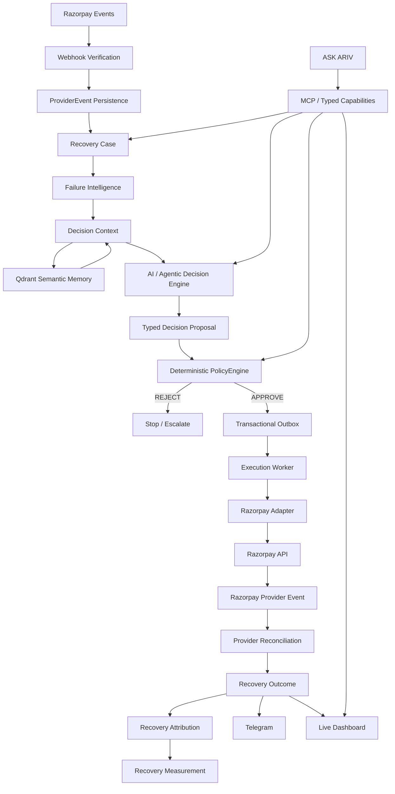

## The System in One View

```text
                    ┌─────────────────────┐
                    │      Razorpay       │
                    │ Payments + Events   │
                    └──────────┬──────────┘
                               │
                               ▼
                    ┌─────────────────────┐
                    │ Webhook Verification│
                    └──────────┬──────────┘
                               │
                               ▼
                    ┌─────────────────────┐
                    │ ProviderEvent Store │
                    └──────────┬──────────┘
                               │
                               ▼
                    ┌─────────────────────┐
                    │   Recovery Case     │
                    └──────────┬──────────┘
                               │
                               ▼
                    ┌─────────────────────┐
                    │ Failure Intelligence│
                    └──────────┬──────────┘
                               │
               ┌───────────────┼────────────────┐
               │               │                │
               ▼               ▼                ▼
       ┌────────────┐  ┌──────────────┐  ┌───────────────┐
       │   Qdrant   │  │ AI / Agentic │  │ Tenant Context│
       │   Memory   │  │ Decisioning  │  │ + Constraints │
       └─────┬──────┘  └──────┬───────┘  └───────────────┘
             │                 │
             └────────┬────────┘
                      ▼
             ┌───────────────────┐
             │ Typed Decision    │
             │ Proposal          │
             └─────────┬─────────┘
                       │
                       ▼
             ┌───────────────────┐
             │ Deterministic     │
             │ PolicyEngine      │
             └───────┬─────┬─────┘
                     │     │
                REJECT│     │APPROVE
                     │     │
                     ▼     ▼
               ┌───────┐  ┌─────────────────┐
               │ Stop /│  │ Transactional   │
               │Escalate│  │ Outbox          │
               └───────┘  └────────┬────────┘
                                    │
                                    ▼
                           ┌─────────────────┐
                           │ Execution Worker│
                           └────────┬────────┘
                                    │
                                    ▼
                           ┌─────────────────┐
                           │ Razorpay Adapter│
                           └────────┬────────┘
                                    │
                                    ▼
                               Razorpay
                                    │
                                    ▼
                           Provider Event
                                    │
                                    ▼
                           Reconciliation
                                    │
                   ┌────────────────┼────────────────┐
                   ▼                ▼                ▼
             Recovery Outcome   Attribution      Measurement
                   │
             ┌─────┴──────┐
             ▼            ▼
         Dashboard      Telegram
```

---

# Product Flow

## 1. Detect — Revenue Risk

Razorpay payment events enter ARIV through a verified webhook boundary.

The system:

- verifies provider signatures
- preserves provider event identity
- deduplicates repeated events
- persists events durably
- creates or updates recovery cases
- classifies failure states
- protects against late and duplicate events

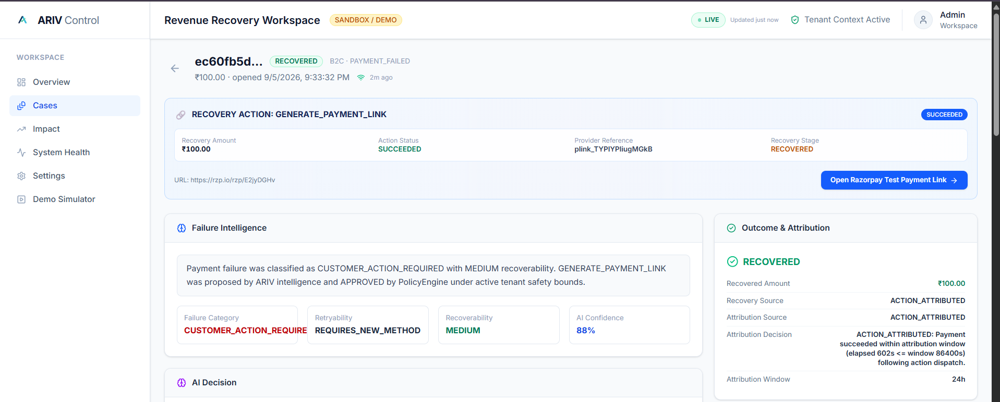

The **Recovery Case** becomes the authoritative unit of the recovery workflow.

---

# 2. Diagnose — Failure Intelligence

ARIV normalizes payment failures into a structured recovery taxonomy.

```text
TRANSIENT_TECHNICAL
CUSTOMER_ACTION_REQUIRED
PAYMENT_METHOD_PROBLEM
PROVIDER_DEGRADATION
MERCHANT_CONFIGURATION
RISK_OR_FRAUD
NON_RETRIABLE
UNKNOWN
```

Each state is evaluated across:

```text
Failure Type
Retryability
Recoverability
Required Customer Action
Provider Context
Tenant Constraints
Available Recovery Actions
Prior Recovery Context
```

This prevents a naive strategy such as:

```text
Every Failure → Retry
```

Instead ARIV determines:

```text
Failure
  ↓
Can it be recovered?
  ↓
How can it be recovered?
  ↓
Is that action allowed?
```

---

# 3. AI / Agentic System

ARIV uses AI where contextual judgment and reasoning add value.

The AI / agentic layer can reason over:

- payment context
- failure classification
- retryability
- recoverability
- tenant constraints
- historical recovery outcomes
- semantic recovery precedent
- available recovery actions
- operational context

The result is a **typed decision proposal**, not an unrestricted command.

### Example

```text
Failure:
CUSTOMER_ACTION_REQUIRED

Retryability:
REQUIRES_NEW_METHOD

Recoverability:
MEDIUM

Proposed Action:
GENERATE_PAYMENT_LINK
```

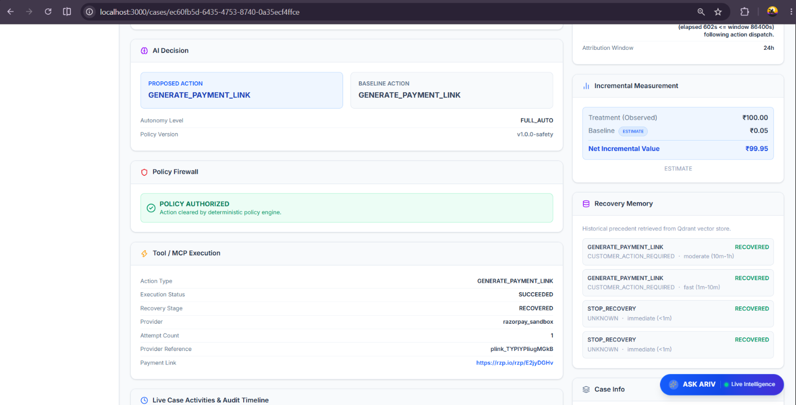

## Agentic boundary

```text
                    AI / LLM
                       │
                       ▼
             Typed Decision Proposal
                       │
                       ▼
              Deterministic Policy
                       │
          ┌────────────┴─────────────┐
          │                          │
       REJECT                     APPROVE
          │                          │
          ▼                          ▼
   STOP / ESCALATE           Durable Workflow
```

The model can reason broadly.

The model does **not** directly become the financial authority.

---

# 4. Qdrant Semantic Recovery Memory

ARIV uses **Qdrant as semantic recovery memory**.

Historical recovery situations can be embedded and retrieved as contextual precedent for future decisions.

```text
Current Failure
      ↓
Embedding
      ↓
Qdrant Similarity Search
      ↓
Similar Historical Cases
      ↓
Recovery Context
      ↓
AI Decision
```

This allows ARIV to incorporate prior recovery experiences into the current decision context.

Examples of semantic questions:

```text
What happened in similar failure cases?

Which intervention was previously effective?

What recovery patterns exist for this failure type?

Are there similar merchant/payment/provider conditions?
```

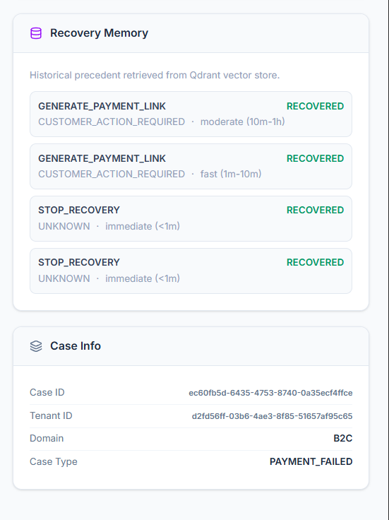

## Architectural role

Qdrant is **intelligence infrastructure**, not authoritative financial state.

```text
PostgreSQL
    =
Authoritative Durable State

Qdrant
    =
Semantic Context / Memory
```

If semantic memory becomes temporarily unavailable, recovery state should remain intact.

---

# 5. Deterministic PolicyEngine

The AI proposal passes through a deterministic **PolicyEngine** before execution.

The PolicyEngine evaluates:

- action safety
- tenant constraints
- autonomy level
- recovery state
- retry boundaries
- authorization rules
- action eligibility
- execution constraints

```text
AI Proposal
     │
     ▼
┌────────────────────────┐
│    PolicyEngine        │
│                        │
│   APPROVE / REJECT     │
└───────────┬────────────┘
            │
            ▼
   Transactional Outbox
```

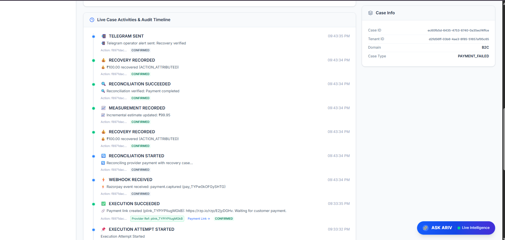

## Why this boundary matters

```text
LLM reasoning
      ≠
Financial authorization
```

ARIV deliberately separates them.

The AI can propose:

```text
RETRY_NOW
RETRY_LATER
REQUEST_PAYMENT_METHOD_UPDATE
GENERATE_PAYMENT_LINK
SEND_REMINDER
ESCALATE_TO_HUMAN
WAIT
STOP_RECOVERY
```

The PolicyEngine decides whether the proposal is allowed.

---

# 6. Durable Execution

Approved actions are persisted through a **transactional outbox** before provider execution.

```text
Policy Approval
      ↓
Transactional Outbox
      ↓
Execution Worker
      ↓
Provider Adapter
      ↓
Razorpay
```

This avoids depending on the lifetime of an HTTP request for financial side effects.

## Execution Worker responsibilities

The worker handles:

- executable-work acquisition
- leases
- idempotency
- bounded provider calls
- execution attempts
- retries where permitted
- state transitions
- concurrency protection
- auditability

The architecture therefore treats execution as a **durable workflow**, not as a best-effort background task.

---

# 7. MCP / Tool Boundary

ARIV exposes controlled capabilities through a typed tool boundary.

The conceptual interaction is:

```text
ASK ARIV / AI Agent
        ↓
Typed Capability
        ↓
Authorization / Policy
        ↓
Backend Service
        ↓
Provider Adapter
        ↓
Razorpay
```

This boundary prevents the model from receiving unrestricted authority over:

```text
Raw SQL
Financial State Mutation
Arbitrary Provider API Calls
Secret Access
Unbounded Execution
Policy Bypass
```

The agent interacts with **capabilities**, not with the entire application internals.

---

# 8. Real Razorpay Provider Execution

Authorized recovery actions execute through the Razorpay integration layer.

For customer-action recovery, one demonstrated workflow is:

```text
Payment Failure
      ↓
CUSTOMER_ACTION_REQUIRED
      ↓
GENERATE_PAYMENT_LINK
      ↓
Policy APPROVED
      ↓
Transactional Outbox
      ↓
Execution Worker
      ↓
Razorpay Payment Link
      ↓
Customer Completes Payment
```

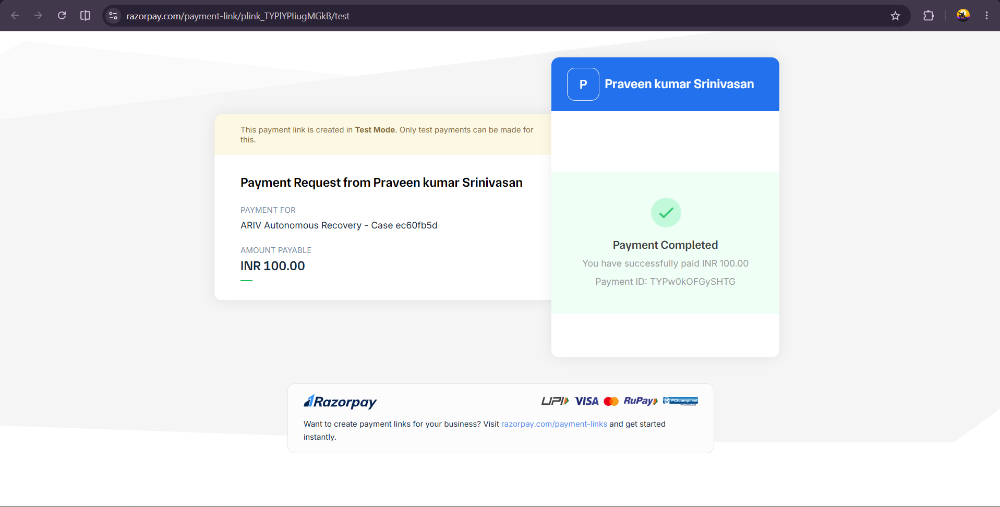

### Important distinction

> **Creating a payment link is not recovering revenue.**

ARIV waits for actual provider-confirmed payment success.

---

# 9. Provider Truth & Reconciliation

Razorpay is treated as an asynchronous external system.

Provider events are therefore processed as external truth.

ARIV handles:

- webhook verification
- provider event identity
- deduplication
- delayed delivery
- duplicate delivery
- out-of-order delivery
- reconciliation
- case correlation

The successful provider event is correlated back to the recovery action.

```text
Razorpay Success Event
        ↓
Payment / Payment Link Reference
        ↓
Execution Attempt
        ↓
Recovery Action
        ↓
Recovery Case
        ↓
Recovery Outcome
```

This prevents the system from assuming:

```text
"Action executed"
```

means:

```text
"Revenue recovered"
```

---

# 10. Verified Recovery & Attribution

ARIV establishes recovery only after provider confirmation and recovery correlation.

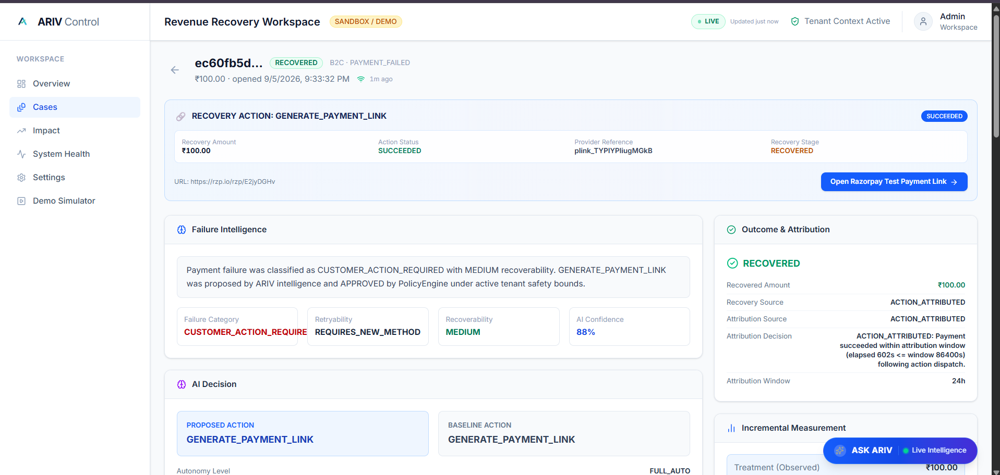

Example:

```text
Recovery:
RECOVERED

Recovered Amount:
₹100.00

Recovery Source:
ACTION_ATTRIBUTED
```

## Three distinct states

### Action Success

The intervention itself succeeded.

```text
Payment Link Created
```

### Provider-Confirmed Recovery

The customer completed payment.

```text
Razorpay Payment = PAID
```

### Attributed Recovery

ARIV established that the payment belongs to the recovery intervention.

```text
RECOVERED
₹100.00
ACTION_ATTRIBUTED
```

Therefore:

```text
ACTION SUCCEEDED
       ≠
PAYMENT SUCCEEDED
       ≠
ATTRIBUTED RECOVERY
```

This distinction is fundamental to trustworthy revenue-recovery measurement.

---

# 11. Recovery Measurement

ARIV records recovery measurement after the outcome is established.

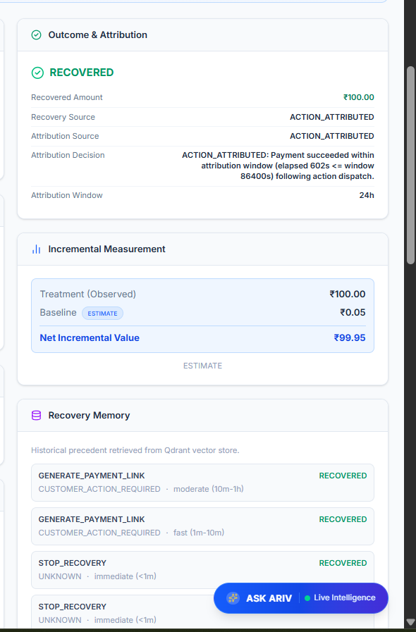

Example:

```text
Treatment Amount:
₹100.00

Estimated Baseline:
₹0.05

Estimated Net Incremental Value:
₹99.95
```

These values are explicitly treated as **estimates**.

ARIV does not claim causal lift without suitable treatment/control evidence.

The architecture leaves room for stronger experimentation later without pretending that observational recovery measurement is automatically causal.

---

# 12. Operational Notification

Verified recovery events are propagated to operational notification channels.

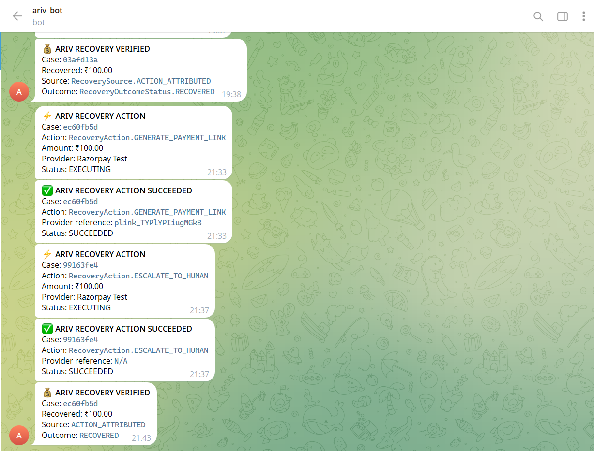

Example:

```text
💰 ARIV RECOVERY VERIFIED

Case: ec60fb5d
Recovered: ₹100.00
Source: ACTION_ATTRIBUTED
Outcome: RECOVERED
```

Telegram is an operational sink.

It is not the source of truth.

The authoritative state remains in the core recovery system.

---

# Real End-to-End Recovery

The demonstrated recovery lifecycle is:

```text
1. Razorpay payment fails
        ↓
2. payment.failed received
        ↓
3. Recovery Case created
        ↓
4. Failure classified
        ↓
5. Decision Context built
        ↓
6. Historical recovery context retrieved
        ↓
7. AI proposes intervention
        ↓
8. PolicyEngine evaluates proposal
        ↓
9. Action authorized
        ↓
10. Transactional Outbox records work
        ↓
11. Execution Worker performs action
        ↓
12. Razorpay Payment Link created
        ↓
13. Customer completes Test Mode payment
        ↓
14. Razorpay success webhook received
        ↓
15. Payment correlated to recovery action
        ↓
16. RecoveryOutcome recorded
        ↓
17. RecoveryMeasurement recorded
        ↓
18. Case becomes RECOVERED
        ↓
19. Telegram notification sent
        ↓
20. Dashboard + ASK ARIV reflect current state
```

### What ARIV considers recovery

> **Creating an intervention is not recovery.**

> **Provider-confirmed success + recovery correlation = verified recovery.**

---

# Architecture Principles

## PostgreSQL — Authoritative State

PostgreSQL is the durable source of truth for financial workflow state.

It stores information such as:

```text
Recovery Cases
Recovery Actions
Execution Attempts
Execution Outbox
Provider Events
Recovery Outcomes
Recovery Measurements
Tenant State
System Settings
Experiments / Baselines
Audit History
```

Financial state does not depend on:

```text
Qdrant
Redis
LLM memory
Frontend state
Telegram
```

---

# Redis — Fast Coordination

Redis is used for fast runtime coordination and supporting operations.

The architectural rule is:

```text
PostgreSQL = Durable Truth
Redis      = Fast Coordination
```

Redis is deliberately not the authoritative store for financial recovery state.

---

# Qdrant — Semantic Memory

Qdrant provides semantic retrieval over historical recovery information.

```text
Failure
  ↓
Embedding
  ↓
Qdrant
  ↓
Similar Recovery Context
  ↓
Decision Context
```

The retriever is tenant-isolated.

Semantic memory enriches decisions without replacing durable workflow state.

---

# Decision Engine

The Decision Engine converts recovery context into a typed proposal.

Supported action categories include:

```text
RETRY_NOW
RETRY_LATER
REQUEST_PAYMENT_METHOD_UPDATE
GENERATE_PAYMENT_LINK
SEND_REMINDER
ESCALATE_TO_HUMAN
WAIT
STOP_RECOVERY
```

The output is structured before it reaches policy evaluation.

---

# Policy Firewall

The PolicyEngine forms the boundary between:

```text
Probabilistic Intelligence
```

and:

```text
Deterministic Financial Execution
```

```text
AI
 ↓
Proposal
 ↓
Policy
 ↓
Authorization
 ↓
Execution
```

A rejected proposal cannot bypass this boundary by calling lower-level provider capabilities directly.

---

# Transactional Outbox

The outbox provides durability between:

```text
Decision
```

and:

```text
Side Effect
```

```text
Decision
   ↓
Policy Approval
   ↓
Outbox Record
   ↓
Worker Lease
   ↓
Provider Execution
```

This is especially important for workflows where execution may continue after the originating API request has already ended.

---

# Execution Worker

The worker is responsible for converting approved recovery actions into controlled provider operations.

Its responsibilities include:

```text
Durable Work Acquisition
Leasing
Idempotency
Execution Attempts
Provider Calls
Bounded Retry
Concurrency Handling
Auditability
```

This makes execution restartable and observable.

---

# Provider Events

Provider events are asynchronous external signals.

ARIV therefore treats:

```text
Webhook received
```

as different from:

```text
Provider state reconciled
```

and from:

```text
Recovery attributed
```

The system preserves provider event identity and protects against duplicate/out-of-order delivery.

---

# Recovery Attribution

Attribution follows the chain:

```text
Provider Success
      ↓
Payment / Payment-Link Reference
      ↓
Execution Attempt
      ↓
Recovery Action
      ↓
Recovery Case
      ↓
Recovery Outcome
```

The goal is to answer:

> **Did this specific recovery intervention actually recover this specific failed payment?**

---

# ASK ARIV

## Conversational Revenue Recovery Control Layer

ASK ARIV is not a generic chatbot.

It is the conversational operational interface over the same authoritative recovery system.

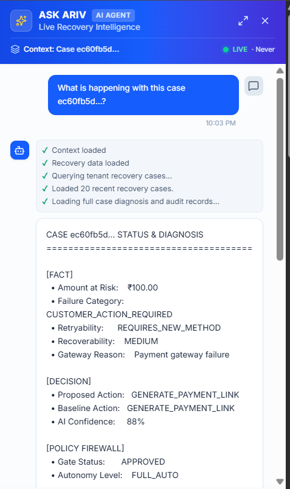

## Example: "What is happening with this case?"

ASK ARIV can summarize the real case state as:

```text
FACT
DECISION
POLICY FIREWALL
ACTION & PROVIDER
OUTCOME & ATTRIBUTION
LATEST ACTIVITY
WHAT HAPPENS NEXT
```

## Example: "Why did ARIV choose this action?"

It explains the actual:

```text
Failure Classification
+
Recovery Context
+
AI Decision
+
Policy Result
```

## Example: "Show me this case."

ASK ARIV can provide navigation to the actual recovery case.

## Example: "How much revenue is at risk?"

The system queries current operational state instead of inventing a number.

## Example: "Recover this case."

ASK ARIV can initiate an authorized recovery workflow through the backend capability boundary.

The model does not directly mutate PostgreSQL or bypass the PolicyEngine.

---

# Live Operations

ARIV provides a live operational surface for monitoring recovery workflows.

The frontend reflects changes from the backend with near-real-time updates.

Operational state includes:

```text
Recovery State
Action Status
Execution Attempts
Provider References
Recovery Outcome
Attribution
Measurement
Audit Timeline
System Health
```

The goal is to make the entire lifecycle observable from:

```text
Failure
   ↓
Decision
   ↓
Execution
   ↓
Provider Confirmation
   ↓
Recovery
   ↓
Measurement
```

---

# System Health

ARIV exposes explicit runtime health information for core and supporting infrastructure.

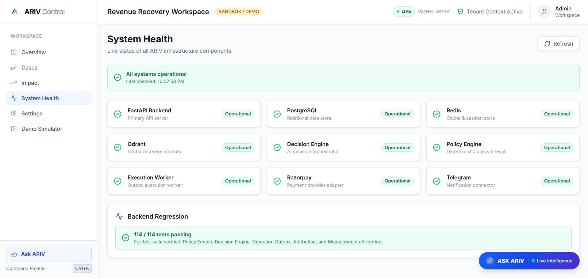

Coverage includes:

```text
FastAPI
PostgreSQL
Redis
Qdrant
Decision Engine
PolicyEngine
Execution Worker
Razorpay
Telegram
```

Core infrastructure problems are surfaced explicitly.

Supporting intelligence and notification dependencies are designed to degrade gracefully without corrupting financial workflow state.

---

# Auditability

Each recovery case maintains an auditable timeline such as:

```text
CASE_CREATED
CLASSIFIED
AI_PROPOSAL
POLICY_EVALUATION
ACTION_AUTHORIZED
EXECUTION_ATTEMPT
WEBHOOK_RECEIVED
RECONCILIATION
RECOVERY_RECORDED
MEASUREMENT_RECORDED
TELEGRAM_SENT
```

The audit trail allows an operator to answer:

```text
What happened?

Why did ARIV choose this action?

Was the action allowed?

Did execution happen?

What did Razorpay confirm?

Was the payment actually recovered?

Which action caused the recovery?

How much revenue was recovered?
```

---

# Security & Safety

ARIV was designed around financial-action safety boundaries.

## Safety Properties

```text
Webhook Signature Verification
Provider Event Deduplication
Tenant Isolation
Deterministic Policy Authorization
Idempotent Execution Keys
Bounded Execution
Optimistic Concurrency Protection
Durable Outbox
Provider-Confirmed Recovery
Explicit Recovery Attribution
Audit Trail
Environment-Based Secrets
No Direct LLM Mutation of Financial State
```

## Secret Management

Never commit:

```text
.env
API Keys
Webhook Secrets
Telegram Tokens
Internal API Keys
Provider Credentials
```

Use:

```text
.env.example
```

as the configuration template.

---

# Engineering Reliability

ARIV was tested against both normal execution and failure conditions.

```text
141 tests passing
0 test failures
```

Coverage includes areas such as:

```text
Agent API
Decision Engine
Failure Intelligence
Policy Enforcement
Execution Controls
Execution Worker
Razorpay Adapter
Recovery APIs
Measurement Semantics
System Health
Webhook Handling
Fresh-Session Webhook Processing
Idempotent Recovery
Concurrency Handling
```

The objective was not simply to make the happy path pass.

The implementation was hardened around real asynchronous provider behavior and distributed-system failure modes.

---

# Real Engineering Problems Solved

Building ARIV against an actual payment-provider workflow exposed real engineering issues.

## Expired Webhook Tunnel

A public development tunnel changed while Razorpay still referenced the previous endpoint.

### Resolution

The registered webhook endpoint was updated and live provider delivery was re-verified.

---

## Request-Scoped Async Database Session

Background provider-event processing initially depended on a request-scoped `AsyncSession`.

### Resolution

Background processing now creates and owns a fresh session and reloads the durable `ProviderEvent`.

---

## Success-Event Processing

Real provider success events exposed incomplete provider-result contracts and incomplete recovery-state updates.

### Resolution

Provider result handling, outcome creation, measurement recording, attribution and recovered-state transitions were corrected.

---

## Concurrency / Duplicate Provider Events

Related success events exposed stale ORM state and concurrency edge cases.

### Resolution

Event processing was hardened while preserving:

```text
Idempotency
+
Optimistic Concurrency
+
Durable State
```

---

## Case Detail Endpoint

A query-path name-shadowing issue caused the case-detail endpoint to return HTTP 500.

### Resolution

The query path was fixed and regression coverage was added.

---

# Why the Closed Loop Matters

A simple retry system looks like:

```text
Failure
  ↓
Retry
  ↓
Done
```

ARIV instead implements:

```text
Failure
  ↓
Understand the failure
  ↓
Understand the context
  ↓
Retrieve semantic precedent
  ↓
Reason about intervention
  ↓
Apply deterministic policy
  ↓
Execute safely
  ↓
Observe provider truth
  ↓
Verify recovery
  ↓
Attribute revenue
  ↓
Measure outcome
  ↓
Learn from recovery history
```

The objective is not:

> **maximize retries**

The objective is:

> **maximize intelligent, bounded, measurable recovery.**

---

# Failure-to-Recovery State Machine

A simplified lifecycle is:

```text
                    ┌──────────────────┐
                    │ PAYMENT RECEIVED │
                    └────────┬─────────┘
                             │
                             ▼
                    ┌──────────────────┐
                    │ PAYMENT FAILED   │
                    └────────┬─────────┘
                             │
                             ▼
                   ┌────────────────────┐
                   │ CLASSIFY FAILURE   │
                   └─────────┬──────────┘
                             │
          ┌──────────────────┼─────────────────────┐
          │                  │                     │
          ▼                  ▼                     ▼
   RETRYABLE           CUSTOMER ACTION       NON-RETRIABLE
          │                  │                     │
          ▼                  ▼                     ▼
   Candidate Retry     Recovery Link         STOP RECOVERY
          │                  │
          └──────────┬───────┘
                     ▼
              AI DECISION
                     │
                     ▼
              POLICY ENGINE
                │       │
             REJECT    APPROVE
                │       │
                ▼       ▼
             STOP     OUTBOX
                         │
                         ▼
                      WORKER
                         │
                         ▼
                     RAZORPAY
                         │
                         ▼
                  PROVIDER EVENT
                         │
                         ▼
                   RECONCILIATION
                         │
                         ▼
                     RECOVERY
                         │
                         ▼
                    ATTRIBUTION
                         │
                         ▼
                    MEASUREMENT
```

---

# Technology Stack

| Layer | Technology |
|---|---|
| Backend API | FastAPI |
| Runtime | Python 3.11 |
| Database | PostgreSQL |
| ORM | SQLAlchemy Async |
| Cache / Coordination | Redis |
| Semantic Memory | Qdrant |
| Embeddings | BGE-based embedding pipeline |
| AI / Agent | LLM-driven reasoning |
| Tool Boundary | MCP / typed capability interfaces |
| Policy | Deterministic PolicyEngine |
| Workflow | Transactional Outbox + Execution Worker |
| Payments | Razorpay Test APIs |
| Notifications | Telegram |
| Frontend | Next.js + React |
| UI Data | React Query |
| Charts | Recharts |
| Styling | Tailwind / shadcn |
| Containers | Docker Compose |
| Migrations | Alembic |

---

# Repository Structure

```text
ARIV/
│
├── app/
│   ├── api/
│   ├── core/
│   ├── domain/
│   ├── infrastructure/
│   ├── interfaces/
│   └── services/
│
├── frontend/
│   ├── src/
│   ├── public/
│   └── package.json
│
├── alembic/
│   └── versions/
│
├── tests/
├── scripts/
│
├── docs/
│   └── screenshots/
│       ├── 01-command-center.png
│       ├── 02-failed-payment-case.png
│       ├── 03-ai-decision-policy.png
│       ├── 04-recovery-action.png
│       ├── 05-razorpay-test-payment.png
│       ├── 06-recovered-attribution.png
│       ├── 07-telegram-recovery.png
│       ├── 08-ask-ariv.png
│       ├── 09-qdrant-memory.png
│       ├── 10-system-health.png
│       └── 11-measurement.png
│
├── docker-compose.yml
├── Dockerfile
├── requirements.txt
├── .env.example
└── README.md
```

---

# Local Development

## Prerequisites

- Docker Desktop
- Docker Compose
- Git
- Razorpay Test Mode credentials
- Telegram configuration for notifications

## Configuration

```bash
cp .env.example .env
```

Fill in the required local environment values.

Never commit `.env`.

## Start the Stack

```bash
docker compose up -d --build
```

Backend:

```text
http://localhost:8000
```

Frontend:

```text
http://localhost:3000
```

## Run Tests

```bash
docker compose exec web pytest -q
```

## Inspect Services

```bash
docker compose ps
```

---

# Demo Flow

## Scenario A — Customer Action Recovery

This is the strongest demonstrated end-to-end workflow.

```text
PAYMENT_FAILED
      ↓
CUSTOMER_ACTION_REQUIRED
      ↓
GENERATE_PAYMENT_LINK
      ↓
Policy APPROVED
      ↓
Payment Link Created
      ↓
Customer Completes Payment
      ↓
payment_link.paid
      ↓
RECOVERED
      ↓
ACTION_ATTRIBUTED
      ↓
Measurement
      ↓
Telegram Notification
```

The important part is that the flow continues all the way to provider-confirmed recovery.

---

# Scenario B — Retryable Recovery Decision

For retryable/transient failures:

```text
PAYMENT_FAILED
      ↓
TRANSIENT_TECHNICAL
      ↓
Retryability Assessment
      ↓
AI Recovery Decision
      ↓
PolicyEngine
      ↓
Bounded Execution
      ↓
Provider Outcome
```

The exact provider operation depends on the supported Razorpay workflow and the configured recovery action.

ARIV does not fabricate provider execution merely to create a successful demo state.

---

# Screenshots

The screenshot walkthrough mirrors the actual recovery lifecycle.

## 01 — Command Center


## 02 — Failed Payment Case


## 03 — AI Decision + PolicyEngine


## 04 — Recovery Action


## 05 — Razorpay Test Payment


## 06 — Recovered + Attribution


## 07 — Telegram Recovery Notification


## 08 — ASK ARIV


## 09 — Qdrant Semantic Recovery Memory


## 10 — System Health


## 11 — Recovery Measurement


---

# Design Philosophy

ARIV is built around one principle:

> **Financial AI should be allowed to reason broadly, but financial execution should remain bounded, observable, deterministic, and reversible where possible.**

The architecture therefore separates:

```text
Probabilistic Reasoning
        ↓
Deterministic Authorization
        ↓
Durable Execution
        ↓
External Provider Truth
        ↓
Verified Attribution
        ↓
Measurement
```

This separation allows ARIV to combine:

```text
AI reasoning
+
Semantic memory
+
Agentic workflows
+
Deterministic controls
+
Reliable infrastructure
+
Real provider integration
```

without treating the language model as the final financial authority.

---

# Core Engineering Invariants

ARIV is designed around several invariants.

### Invariant 1 — No Provider Truth, No Recovery

```text
Action Execution
      ≠
Verified Recovery
```

Provider confirmation is required.

### Invariant 2 — No Policy Approval, No Financial Action

```text
AI Proposal
      ↓
PolicyEngine
      ↓
Execution
```

### Invariant 3 — Semantic Memory Is Not Financial Truth

```text
Qdrant
      ≠
PostgreSQL
```

Qdrant enriches decisions.

PostgreSQL owns durable state.

### Invariant 4 — Notification Is Not State

```text
Telegram
      ≠
Recovery Source of Truth
```

Notifications consume verified outcomes.

### Invariant 5 — The Agent Does Not Bypass the Backend

```text
Agent
  ↓
Typed Capability
  ↓
Policy
  ↓
Backend
```

---

# What Makes ARIV a Recovery Control Plane?

ARIV combines several layers into a single closed-loop workflow:

```text
Revenue Risk
    ↓
Failure Intelligence
    ↓
Semantic Recovery Memory
    ↓
Agentic Decisioning
    ↓
Deterministic Policy
    ↓
Durable Execution
    ↓
Provider Confirmation
    ↓
Recovery Attribution
    ↓
Measurement
    ↓
Operational Feedback
```

The system therefore controls not merely the recommendation but the lifecycle around the recommendation.

That makes the architecture closer to a **revenue-recovery control plane** than a simple payment-retry service.

---

# Final Takeaway

ARIV is not simply:

> **"AI retries failed payments."**

It is a **revenue-recovery control plane** connecting:

> **failure intelligence → semantic memory → agentic decisioning → deterministic policy → durable execution → Razorpay provider confirmation → recovery attribution → measurement → operations**

The system is deliberately designed so that:

```text
Recommendation
    ≠
Execution

Execution
    ≠
Recovery

Payment Success
    ≠
Attributed Recovery
```

Instead:

```text
AI Reasoning
     ↓
Policy Authorization
     ↓
Bounded Execution
     ↓
Provider Confirmation
     ↓
Verified Attribution
     ↓
Measured Recovery
     ↓
Operational Visibility
```

---

# Built for Razorpay AI Buildathon — Track 03

## ARIV — Agentic Revenue Recovery

> **Detect. Decide. Authorize. Execute. Verify. Attribute. Measure.**

<p align="center">
  <strong>🤖 AI reasoning</strong>
  &nbsp; + &nbsp;
  <strong>🧠 Qdrant semantic memory</strong>
  &nbsp; + &nbsp;
  <strong>🛡️ deterministic policy</strong>
  &nbsp; + &nbsp;
  <strong>⚙️ durable execution</strong>
  &nbsp; + &nbsp;
  <strong>💳 Razorpay provider truth</strong>
  &nbsp; + &nbsp;
  <strong>📈 recovery attribution</strong>
</p>
